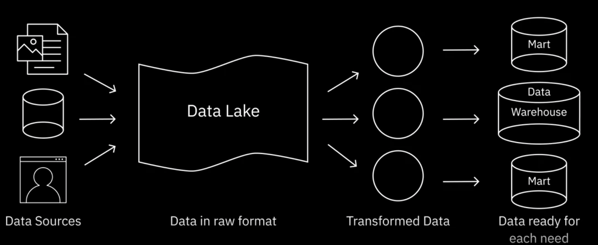

# Overview of Data Repositories

### Databases

#### Factors governing choice of database include:

- Data type

- Data structure

- Querying mechanism

- Latency requirements

- Transaction speeds

- Intended use of data

  

# Relational(RDBS) and Non-relational databases

- Relational Databases(Relational Database Management System RDBMS): A relational database is a collection of data organized into a table structure, where the tables can be linked, or related, based on data common to each.

- Advantages:
  
  Creating meaningful information by joining tables;
  
  Flexibility to make changes while the database is in use;
  
  Minimize data redundancy by allowing relationships to be defined between tables.
  
  Ease of backup and disaster recovery 
  
  **ACID** compliant: Atomicity, Consistency, Isolation, Durability
  
- Use Cases for RDBMS

  Online Transaction Processing (OLTP)

  Data Warehouse

  IoT Solutions
  
- Limitation of RDBMS

  Does not work well with semi-structured and unstructured data 

  Migration between to RBDMs is possible only when the source and destination tables have identical schemas and data types

  Entering a value greater than the defined length of a data field results in a loss of information.

# NoSQL

### Key-value store
- Key-value pairs
### Document Based
- Store each record and its associated data within a single document.

  Perferable for eCommerce platform, medcal records storage, CRM(Customer Relationship Management) platforms and anlytics platform.

### Column Based 
- Column-based models store data in cells grouped as columns of data instead of rows.

  Cells corresponding to a column are saved as continuous disk entry, making access and search easier and faster. 

- Not suitable for frequent query

### Graph Based

- Use a graphical model to represent and store data

  Useful for visualizing, analyzing and finding connections between different pieces of data

- Great for Scocial networks; Product recommendations; Network diagrams, Fraud detection, Access management

- Not good to large-volume analytics queries

### NoSQL
(Created in response to the limitations of traditional database technology)
- Primary advantage of NoSQL is its ability to handle large volumes of structured, semi-structured data.

- More agile, flexible and iterate more quickly
  

  

# Data Warehouses

### Data Warehouses

### Data Marts

Store past and current data has been cleaned, conformed, and categorised

### Data Lakes

Provide analytical capabilities for a restricted area of the data warehouse. 

Offer isolated security and isolated performance.

Business reporting and analysis 

### ETL

A general process: Gathering; Extracting; Cleaning,standardizing, and transforming data into usable format.
Loading data into a data repository.

### Data Pipelines

Encompassed the entire journey of moving data from one system to another, including the ETL process

Can be used for both batch and streaming data

Supports both long-running batch queries and smaller interactive queries

Typically loads data into a data lake but can also load data into a variety of target destinations-including other applications and visualisation tools.

# Foundations of Big Data

big data refers to the dynamic, large, and disparate volumes of data being created by people, tools, and machines. It requires new, innovative and scalable technology to collect, host, and analytically process the vast amount of data gathered in order to drive real-time business insights that relate to consumers, risk, profit, performance, productivity management, and enhanced shareholder value. There is no one definition of big data but there are certain elements that are common across the different definitions, such as velocity, volume, variety, veracity, and value.

- Velocity

  Be generated extremely fast.

- Volume

- Variety

  Diversity of data

- Veracity

  Reliability, accuracy, and truthfulness of the data being analyzed

- Value

  Turn data into value.

# Big Data Processing Tools

- Apache Hadoop
- Apache Hive
- Apache Spark

# Summary and Highlights

A Data Repository is a general term that refers to data that has been collected, organized, and isolated so that it can be used for reporting, analytics, and also for archival purposes. 

### The different types of Data Repositories include: 

- Databases, which can be relational or non-relational, each following a set of organizational principles, the types of data they can store, and the tools that can be used to query, organize, and retrieve data.
- Data Warehouses, that consolidate incoming data into one comprehensive storehouse. 
- Data Marts, that are essentially sub-sections of a data warehouse, built to isolate data for a particular business function or use case. 
- Data Lakes, that serve as storage repositories for large amounts of structured, semi-structured, and unstructured data in their native format. 
- Big Data Stores, that provide distributed computational and storage infrastructure to store, scale, and process very large data sets.

#### ETL, or Extract Transform and Load, Process is an automated process that converts raw data into analysis-ready data by:

- Extracting data from source locations.
- Transforming raw data by cleaning, enriching, standardizing, and validating it.
- Loading the processed data into a destination system or data repository.

#### Data Pipeline
Sometimes used interchangeably with ETL, encompasses the entire journey of moving data from the source to a destination data lake or application, using the ETL process. 

#### Big Data

Refers to the vast amounts of data that is being produced each moment of every day, by people, tools, and machines. The sheer velocity, volume, and variety of data challenge the tools and systems used for conventional data. These challenges led to the emergence of processing tools and platforms designed specifically for Big Data, such as Apache Hadoop, Apache Hive, and Apache Spark.
