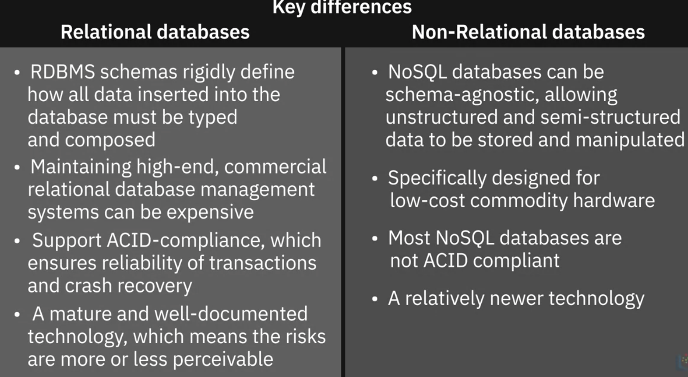

# Overview of Data Repositories

### Databases

#### Factors governing choice of database include:

- Data type
- Data structure
- Querying mechanism
- Latency requirements
- Transaction speeds
- Intended use of data

# Relational(RDBS) and Non-relational databases

- Relational Databases(Relational Database Managent System RDBMS): A relational database is a collection of data organized into a table structure, where the tables can be linked, or related, based on data common to each.

- Advantages:
  
  Creating meaningful information by joining tables;
  
  Flexibility to make changes while the database is in use;
  
  Minimize data redundancy by allowing relationships to be defined between tables.
  
  Ease of backup and disaster recovery 
  
  **ACID** compliant: Atomicity, Consistency, Isolation, Durability
  
- Use Cases for RDBMS

  Online Transaction Processing (OLTP)

  Data Warehouse

  IoT Solutions
  
- Limitation of RDBMS

  Does not work well with semi-structured and unstructured data 

  Migration between to RBDMs is possible only when souce and destination table hace identical schemas and data types

  Entering a value greater than the defined length of a data field results in loss information.

# NoSQL

### Key-value store
- Key-value pairs
### Document Based
- Store each record and its associated data within a single document.

  Perferable for eCommerce platform, medcal records storage, CRM(Customer Relationship Management) platforms and anlytics platform.

### Column Based 
- Column-based models store data in cells grouped as columns of data instead of rows.

  Cells corresponding to a column are saved as continuous disk entry, making access and search easier and faster. 

- Not suitable for frequent query

### Graph Based

- Use a graphical model to represent and store data

  Useful for visualizing, analyzing and finding connections between different pieces of data

- Great for Scocial networks; Product recommendations; Network diagrams, Fraud detection, Access management

- Not good to large-volume analytics queries

### NoSQL
(Created in response to the limitations of traditional database technology)
- Primary advantage of NoSQL is its ability to handle large volumes of structured, semi-structured data.

- More agile, flexible and iterate more quickly
  

  

