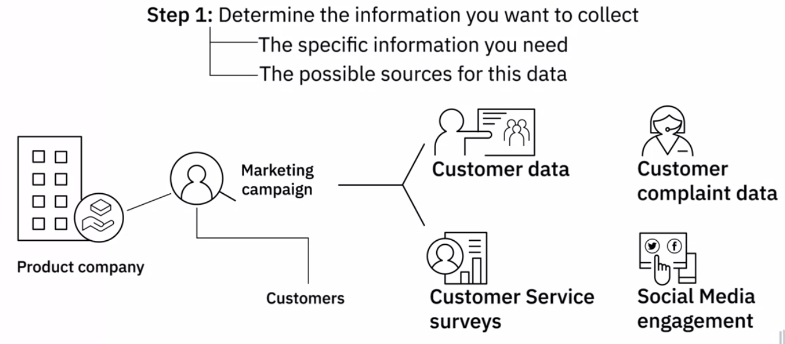
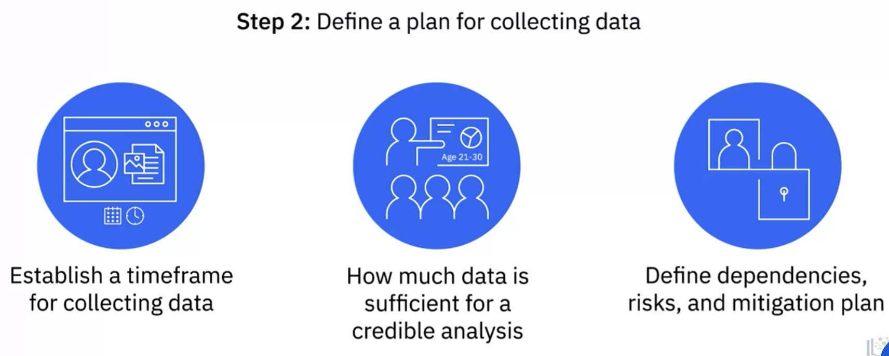
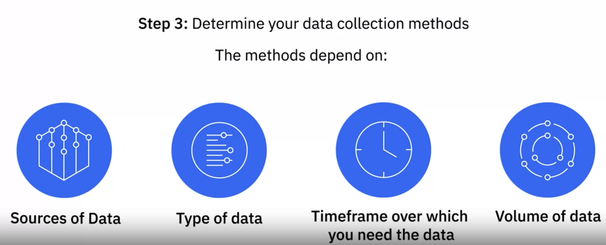

# Gathering Data

## Identifying Data for Analysis

- Determine the information i want to collect

- Define a plan for collecting data

- Determine data collection methods

#### Data Quality

Free of errors; Accurate; Complete; Relevant; Accessible;

#### Data governance

Security; Regulation; Compliance

### Data Privacy

Confidentiality; License for use; Compliance to mandated regulations

## Data Sources

- Primary

  Data obtained by me from the souce directly.

- Secondary

  Information retrieved from existing sources

- Third-party

  Purchased from aggregators who collect data from various sources and combine it into comprehensive datasets for purpose of selling the data

  

## How to Gather and Import Data

- SQL
- API Application Programming Interfaces
- Extracting from web
- Sensor Data
- Data exchanges platform
- Other

#### Structured data
- Relational databases store structured data with a well -defined schema
- Sources include data from OLTP systems, spreadsheets,
#### Semi-Structured data
- Email,XML,zipped files, binary
#### Un
- web page, social media