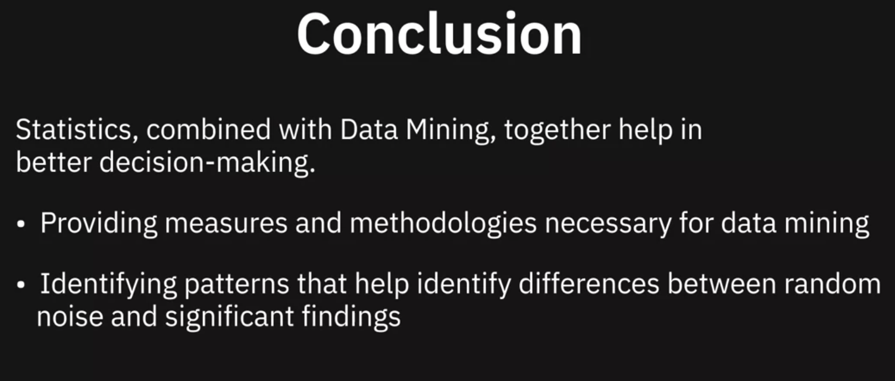
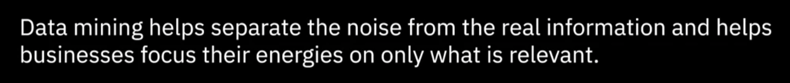
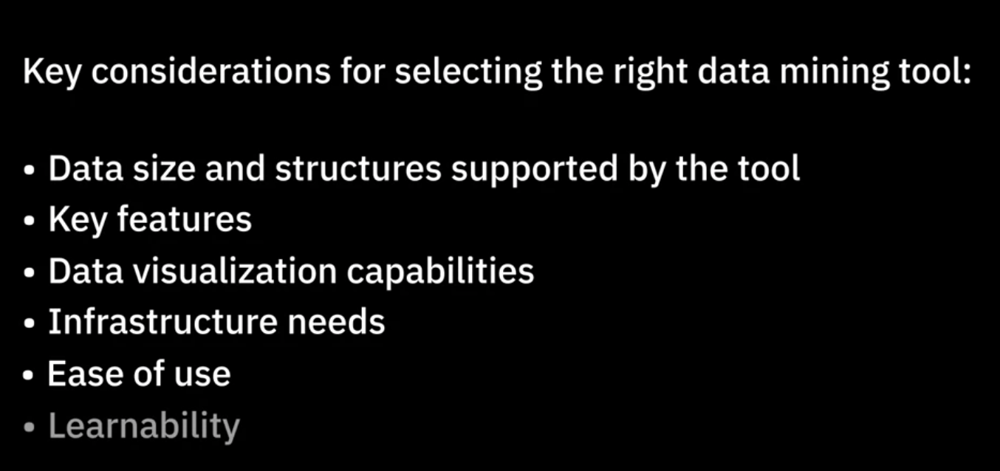

# Analyzing And Mining Data

## Overview of Statistical Analysis

### 1Statistics

- Calculations such as average income, high-paid professions
- Analyzing vaccine data to ensure safety and efficacy
- Gaining greater insight into customer requirements to reduce customer churn
### 2Statistical Analysis
Statistical methods to a samole of data in order to develop an understanding of what that data represent

- Statistical methods help ensure Data is interpreted correctly

- Apparent relationships are meaningful

Type of statistics
- Descriptive statistics - Summarizing information about the sample: Easier to  understanding data , without inference.

  Central Tendency: Mean, Median, Mode

  DISPERSION:(measures of variability in dataset). VARIANCE(defines how far away the data points fall from the centre)；STANDARD DEVIATION(tells you how tightly your data is clustered around the mean), RANGE:(give you the distance between the smallest and largest values in your datasets)

  Skewness: is the measure whether the distribution of values is symmetrical around a central value or skewed left or right

- Inferential statistics - Making inference or generalizations about the broader population

  Hypothesis Testing

  Confidence Intervals

  Regression Analysis

## Data Mining 

Extracting knowledge from data

Interdisciplinary field that involves Recognition Technologies, Statistical Analysis, Mathematical Techniques

Goal(Aim) is identify correlations in data, find **patterns** and variations, understand **trends** and predict probilities.

#### Patterns and Trends

Pattern Recognition: Discovery of <u>regularities or commonalities</u> in data.

Trend is the <u>general</u> tendency of a set of data to change over time

- Classification
- Clustering: Group
- Anomaly or Outlier Detection
- Association Rule Mining
- Sequential Patterns
- Affinity Grouping
- Decision tree

  

# Tools for data Mining

- Spreadsheet
- R
- Python
- SPSS(Statistical Process for Social Sciences)
- IBM Watson Studio
- SAS

> # Summary and Highlights
>
> In this lesson, you have learned the following information: 
>
> Statistics is a branch of mathematics dealing with the collection, analysis, interpretation, and presentation of numerical or quantitative data. 
>
> Statistical Analysis involves the use of statistical methods in order to develop an understanding of what the data represents. 
>
> Statistical Analysis can be:
>
> - Descriptive; that which provides a summary of what the data represents. Common measures include Central Tendency, Dispersion, and Skewness.
> - Inferential; that which involves making inferences, or generalizations, about data. Common measures include Hypothesis Testing, Confidence Intervals, and Regression Analysis.
>
> Data Mining, simply put, is the process of extracting knowledge from data. It involves the use of pattern recognition technologies, statistical analysis, and mathematical techniques, in order to identify correlations, patterns, variations, and trends in data. 
>
> There are several techniques that can help mine data, such as, classifying attributes of data, clustering data into groups, establishing relationships between events, variables, and input and output. 
>
> A variety of software and tools are available for analyzing and mining data. Some of the popularly used ones include Spreadsheets, R-Language, Python, IBM SPSS Statistics, IBM Watson Studio, and SAS, each with their own set of characteristics, strengths, limitations, and applications. 

## Communicating Data Analysis Findings

### Overview of Communicating and Sharing Data Analysis Findings

##### Data projects

- The result of a collaborative effort spread across business functions.
- People with multi-disciplinary skills
- Findings incorporated in a larger business initiative

As a data analyst, I need tell the story with my data by visualizing the insights clearly and creating a <u>structured narrative explicitly</u> targeted at your audience.

Think about: 
- Who is my audience?

- What is important to them? 

  Too much information will have my audience strugging to comprehend the point i am making. Presentation is not data dump, facts and figures alone do not influence decisions. I need make a compelling story, include only that info as is needed to address the business problems.

- What will help them trust me?

  Fall back on the assumption that what we're here for. Begin by demostrating the understanding of the <u>business problem</u> to audience and the outcome need to be solved.

##### Structure my presentation

Design my communication is to structure and organize my presentation for maximum impact

- Reference my data: Establish my findings with data
- State my assumptions: Work towards establishing credibility of your findings along the way, don't gloss over.
- Organize my presentation
- Identify the best formats for presenting my data

 The Role of Visuals

A powerful visualizations(graphs,charts,diagrams) are great way to <u>bring data to life</u>.Trust, Understanding, Reliability

### Viewpoints: Storytelling in Data Analysis

Humen naturlly understand the world with data

It doesn't matter what information you have if you can not communicate it effectively to your audience.

The best way to communicate your information is through visuals and telling a story

### Introduction to Data Visualization

Data Vis is the discipline of communicating info through the use of visual elements such as graphs, charts, and maps. Its goal is to make information easy to comprehend interpret and retain.

##### Choosing appropriate visualisations:

- What relationship I am trying to establish
- Do i want to compare multiple values, such as the number of products sold, and revenues generated over the last three years?
- Do i need my audience to see correlation between two variables?
- Do i want to detect anomalies in data?

whether the visualization needs to be static ot interactive

# Summary

> In this lesson, you have learned the following information: 
>
> Data has value through the stories that it tells. In order to communicate your findings impactfully, you need to: 
>
> - Ensure that your audience is able to trust you, understand you, and relate to your findings and insights.
> - Establish the credibility of your findings.
> - Present the data within a structured narrative.
> - Support your communication with strong visualizations so that the message is clear and concise, and drives your audience to take action.
>
> Data visualization is the discipline of communicating information through the use of visual elements such as graphs, charts, and maps. The goal of visualizing data is to make information easy to comprehend, interpret, and retain. 
>
> For data visualization to be of value, you need to:
>
> - Think about the key takeaway for your audience.
> - Anticipate their information needs and questions, and then plan the visualization that delivers your message clearly and impactfully.
>
> There are several types of graphs and charts available for you to be able to plot any kind of data, such as bar charts, column charts, pie charts, and line charts. 
>
> You can also use data visualization to build dashboards. Dashboards organize and display reports and visualizations coming from multiple data sources into a single graphical interface. They are easy to comprehend and allow you to generate reports on the go.
>
> When deciding which tools to use for data visualization, you need to consider the ease-of-use and purpose of the visualization. Some of the popularly used tools include Spreadsheets, Jupyter Notebook, Python libraries, R-Studio and R-Shiny, IBM Cognos Analytics, Tableau, and Power BI. 
>
> 

