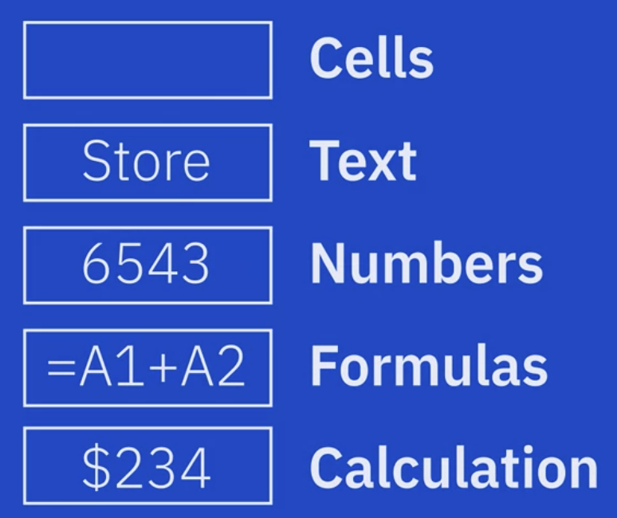

# Spreadsheet Basics Part1

 .xlsx file

The workbook contains: Data, Calculations, Functions, Underlying Elements

One workbook contains more worksheets, rename the worksheets to make more sense in relation to their porpuses

M20:Column, Row

Range of cells is often referred to as an array

# Basics Part2

