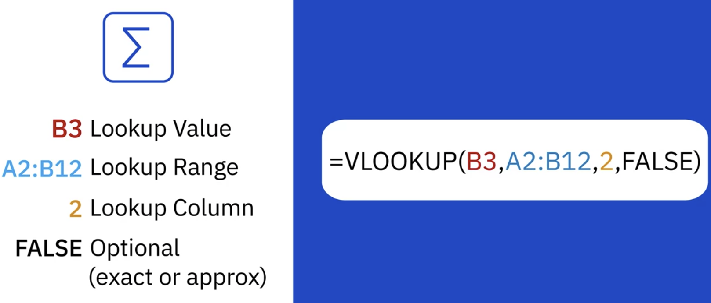
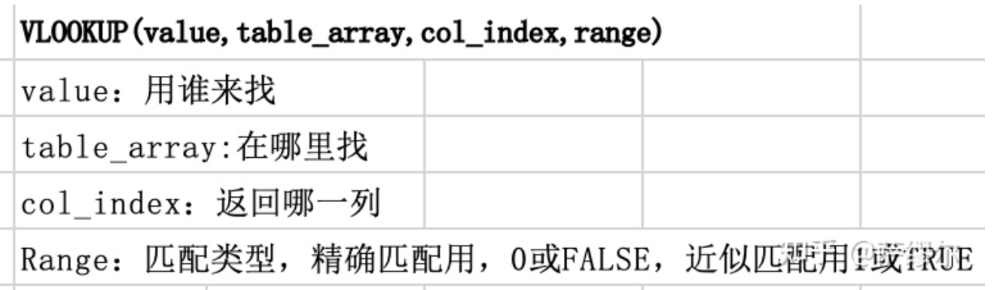

# Analyzing Data Using Spreadsheets

##### Learning Objectives
- Describe the fundamentals of analyzing data using a spreadsheet
- **Filter** and **sort** data in a worksheet.
- Employ some of the most useful Excel functions for data analysis.
- Implement the VLOOKUP and HLOOKUP functions to reference data.
- Create **pivot** tables in Excel.
- Utilize pivot table features.

## Data Analysis Basics, Diltering and Sorting Data

### Intro to Analyzing Data Using Spreadsheets

What should be considered before changes maken:	

(1)How big is the dataset

(2)What type of filtering is required to find the necessary information

(3)How should the data be sorted

(4)what type of calculations are needs

------

- 1Filtering

- 2Sorting

  Alphabetically, numerically

- 3Performing Calculations

  Excel: Mathematical, Statistical, Logical, Financial, Data and Time

- 4Shaping out data

### Filtering and Sorting Data in Excel

##### Filtering

##### Ordering

- Text-based data - Alphabetically
- Number-based data - Numerically
- Data-based data - Chronologically

### Useful Functions for Data Analysis

- IF

  =IF(AD2>300,"Large",IF(AD2>100,"Medium",IF(AD2>0,"Small")))

- IFs: nested IF function

  =IFS(AD3>300,"Large",AD3>100,"Medium",AD3>0,"Small")

- Conditional Formatting

- CountIF

- SUMIF; SUMIFS

  =SUMIF(range, criteria, [sum range])

### Using VLOOKUP and HLOOKUP Functions

B3: the value i am looking for

=VLOOKUP (value, table, col_index, [range_lookup])

Advanced method: https://www.zhihu.com/question/27224727

### 

