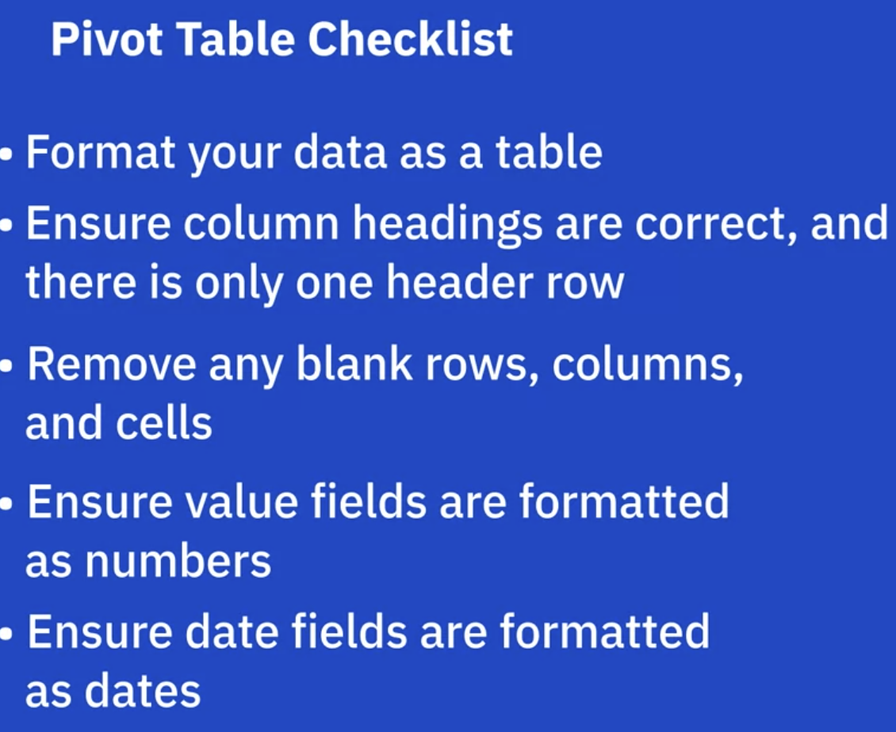

## Using Pivot Tables

Advantages:

> manipulate data without using formulas
>
> Quickly summarize large datasets. A nice way to show only the info that is required
>
> Ability to display engaging charts and graphs

1.Pivot Tables provide a simple and quick way to summarize and analyze data, to observe trends and patterns in data and to make data comparisons

2.Pivot Tables are dynamic, so as data is changed so does the Pivot Table.

3.Data Analysts can use Pivot Tables to draw conclusions about, and create insights into, an organization's data.

### Intro to Creating Pivot Tables in Excel

(Actually I just think pivot table is a simple version of tableau :smile: )

Pivot table in Excel is extensive;  Sum, average, count, group by easily; Powerful when there is only thousand records.

Drill down on the data

### Pivot Table Features

1. Recommended Pivot Tables
2. Filters
3. Slicers
4. Timeline

in a fit state to do sth