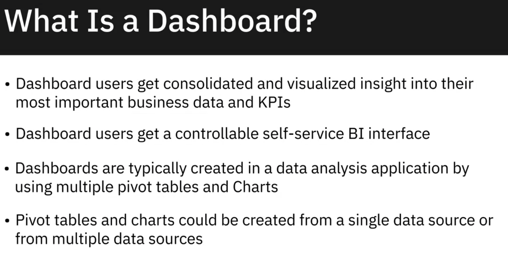
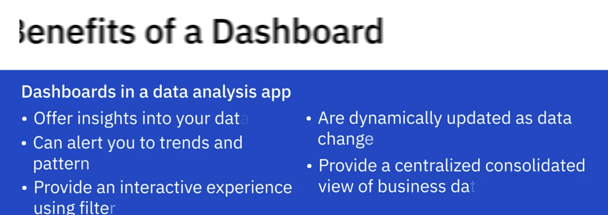

# W2 Creating Visualizations and Dashboard with Spreadsheets

## Creating Advanced Charts

- Treemaps

  Compare values across hierarchy levels

- Scatter Charts

  

- Creating Histograms

## Creating Dashboards Using Spreadsheet

Keep key business information in on place.

Convient

Show the most important stuffs to stakeholders

Help ppl understand 

A clean, focused dashboard can be a major asset when trying to tell a story about data.
