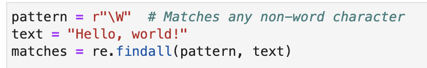

# Python Basics

## Types

- integer
- float
- Boolean

Typecasting.  Cast 1.1 to 1

## Expressions and Variables

Operations, Operands, Operators
asterisk
forward slash
25//6 result will be rounded

## String Operations

Concatnate
escape sequence.  \\n  \\t
string.replace/find

- String.find(pattern, S)

