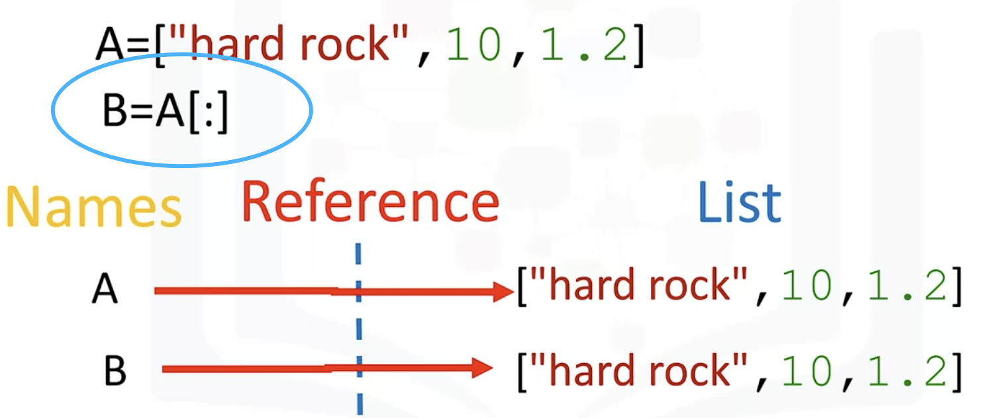

# Python Data Structure

## Lists and Tuples

Compound data types
#### Tuple
All kinds of data can be stored in one tuple.

- Slicing
- Immutable: if wanna change the tuple, need give variable a new tuple
- Nesting

#### List

- concatenate or combine lists by adding ("+"). 
- mutable : **Extend**( can extend a list [] at one go)
- Append: **append a list** instead a list of elements

- Del(A[4]) delete fourth element
- list.split(",")
- Clone: if i use b = a, then change b ,a will be changed as well

 

## Dictionary

key can be any imuatble values even tuple: Dict[(0, 1)]

element = List[index]

Value = dictionary[key]  : key is analogous to the index

curly brackets {}

Add: DICT['Newkey'] = "value"

delete:  del(DICT['key'])

## Sets

