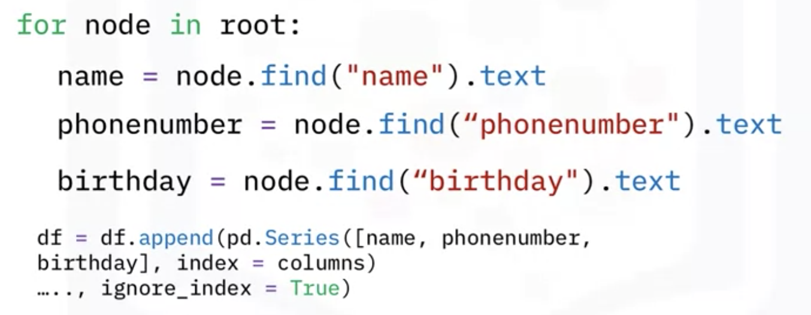

# APIs, and Data Collection

## Simple APIs

**Keys** will give authorizetion to access the source

Application Program Interface (API):

#### What is an API

#### API Libraries

#### Rest API

- Request and Response

  **RE**presentional **S**tate **T**ransfer APIs

  

  

- An Example with PyCoinGecko

## REST APIs, Webscraping, and Working with Files

- Uniform Resource Locator: URL

HTTP: a general protocol of transferring information through the web

The <u>request</u> be send by API communicates via HTTP message.

> Scheme: the protocol, Http://
>
> Internet address or Base URL: www.ibm.com
>
> Route: /images/IDSlogo.png
>
> - http://www.ibm.com/images/IDSNlogo.png

- Request

  Import requests

  

- Response

#### Webscraping

Find_all

All kinds of file formats

- CSV: pandas: df.read_csv("...")

- JSON: import json: 

  

- XML: 

  

  
