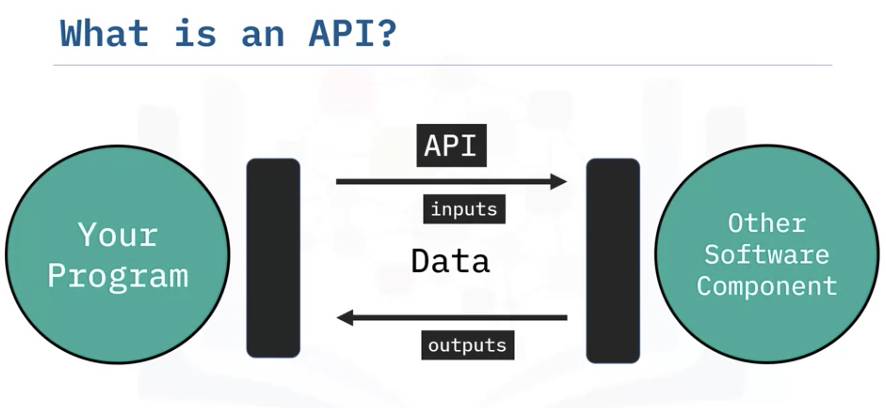

# APIs, and Data Collection

## Simple APIs

**Keys** will give authorizetion to access the source

Application Program Interface (API):

#### What is an API

#### API Libraries

#### Rest API

- Request and Response

  **RE**presentional **S**tate **T**ransfer APIs

  

  

- An Example with PyCoinGecko

## REST APIs, Webscraping, and Working with Files

- Uniform Resource Locator: URL

HTTP: a general protocol of transferring information through the web

The <u>request</u> be send by API communicates via HTTP message.

> Scheme: the protocol, Http://
>
> Internet address or Base URL: www.ibm.com
>
> Route: /images/IDSlogo.png
>
> - http://www.ibm.com/images/IDSNlogo.png

- Request

  Import requests

  

- Response

#### Webscraping

Find_all

All kinds of file formats

- CSV: pandas: df.read_csv("...")

- JSON: import json: 

  

- XML: 

  

  

#### Beautiful soup

 **represents the document as a nested data structure**
soup = BeautifulSoup(html, "html.parser")

print(soup.prettify())

tag_object=soup.title
print("tag object type:",type(tag_object))
tag object type: <class 'bs4.element.Tag'>

tag_object.parent
tag_object.next_sibling

#### Navigable String

unicode_string = str(tag_string)

#### Filter

<table>
  <tr>
    <td id='flight' >Flight No</td>
    <td>Launch site</td> 
    <td>Payload mass</td>
   </tr>
  <tr> 
    <td>1</td>
    <td><a href='https://en.wikipedia.org/wiki/Florida'>Florida</a></td>
    <td>300 kg</td>
  </tr>
  <tr>
    <td>2</td>
    <td><a href='https://en.wikipedia.org/wiki/Texas'>Texas</a></td>
    <td>94 kg</td>
  </tr>
  <tr>
    <td>3</td>
    <td><a href='https://en.wikipedia.org/wiki/Florida'>Florida<a> </td>
    <td>80 kg</td>
  </tr>
</table>

#### find All

table_rows=table_bs.find_all('tr')  --(extract all the tags with that name and its children.)

first_row =table_rows[0]

<h3>Rocket Launch </h3>

<table class='rocket'>
  <tr>
    <td>Flight No</td>
    <td>Launch site</td> 
    <td>Payload mass</td>
  </tr>
  <tr>
    <td>1</td>
    <td>Florida</td>
    <td>300 kg</td>
  </tr>
  <tr>
    <td>2</td>
    <td>Texas</td>
    <td>94 kg</td>
  </tr>
  <tr>
    <td>3</td>
    <td>Florida </td>
    <td>80 kg</td>
  </tr>
</table>

<h3>Pizza Party  </h3>

<table class='pizza'>
  <tr>
    <td>Pizza Place</td>
    <td>Orders</td> 
    <td>Slices </td>
   </tr>
  <tr>
    <td>Domino's Pizza</td>
    <td>10</td>
    <td>100</td>
  </tr>
  <tr>
    <td>Little Caesars</td>
    <td>12</td>
    <td >144 </td>
  </tr>
  <tr>
    <td>Papa John's </td>
    <td>15 </td>
    <td>165</td>
  </tr>

soup = BeautifulSoup(data,"html.parser")

### Table

**BeautifulSoup**

