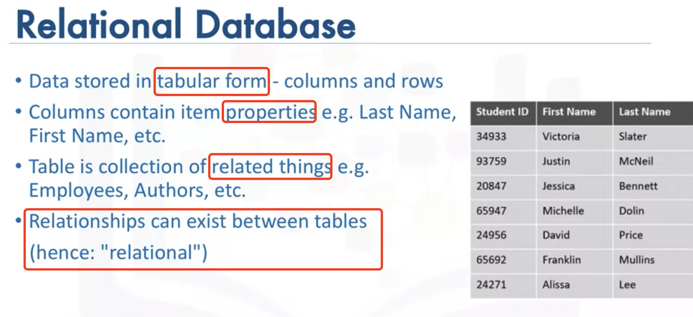
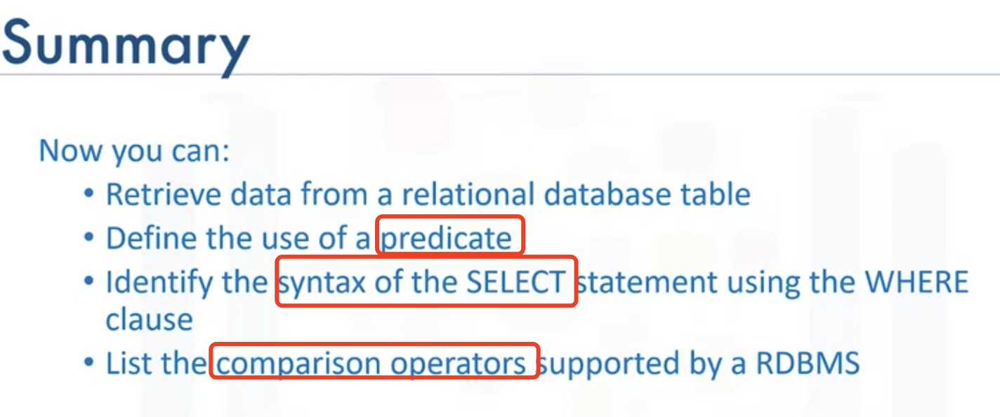

# Getting Start with SQL

## Basic SQL(Structure Query Language)

Data is one of the most <u>critical</u> assets of any business

Data is a collection of FACTs(words, numbers,PIcs)

#### DBMS

A series of software tools for the data in the database is called Database management system

#### 5 Basic SQL command

- Create
- Insert
- Select
- Update
- Delete

### <u>Select</u> (Query)

RMDS is not just to store data but also facilitate <u>retrieval</u> of the data

Relational operation helps us in restricting the result set by allowing us to use the clause **WHERE**

