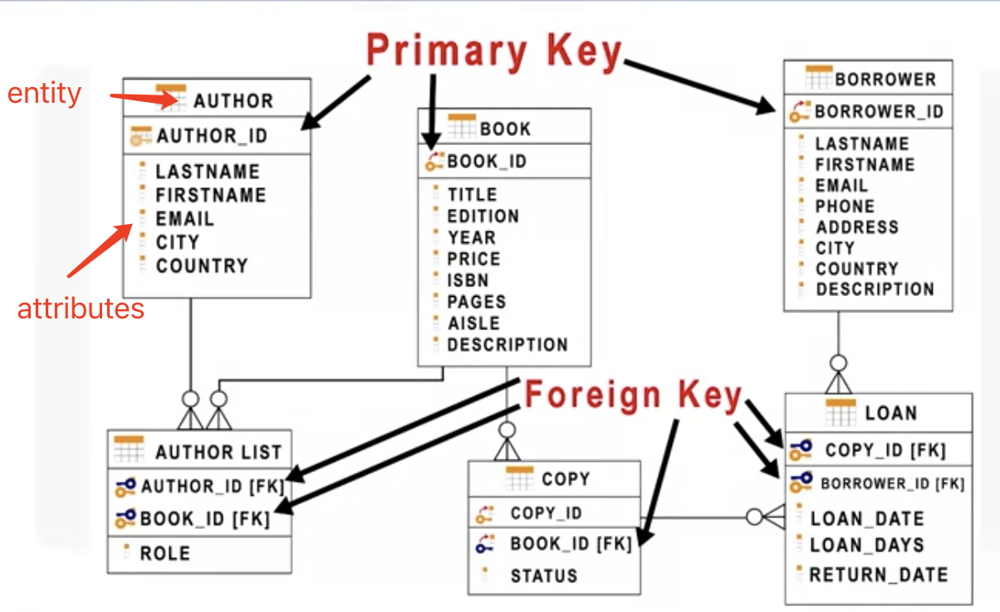
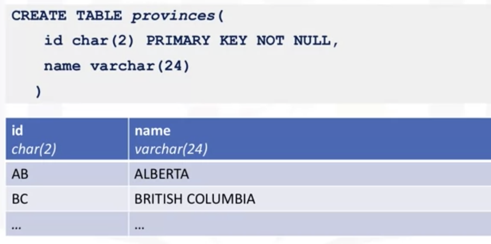
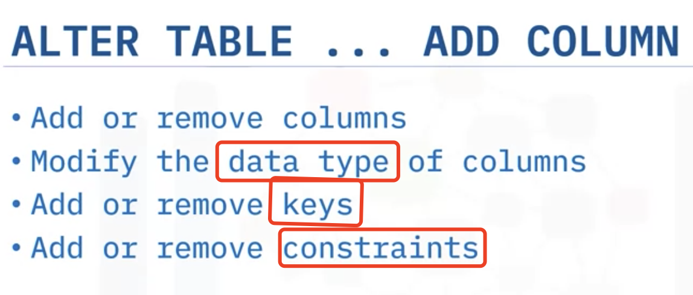
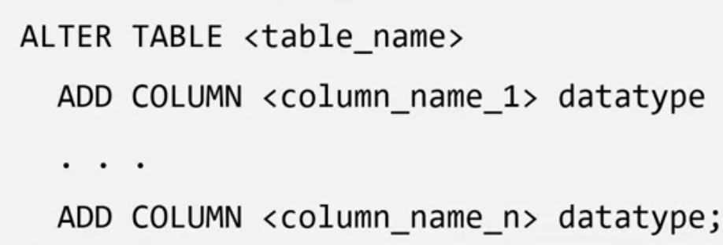
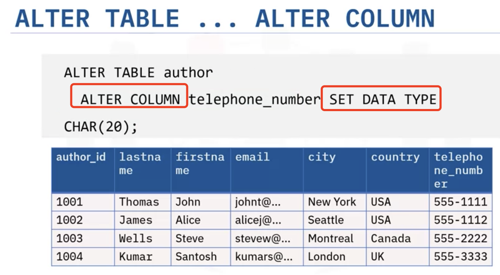
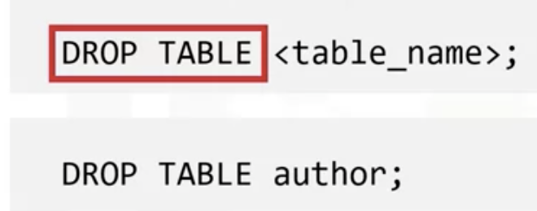
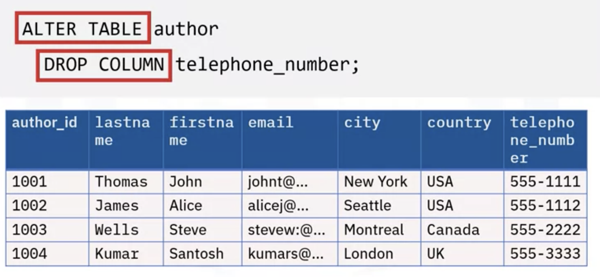
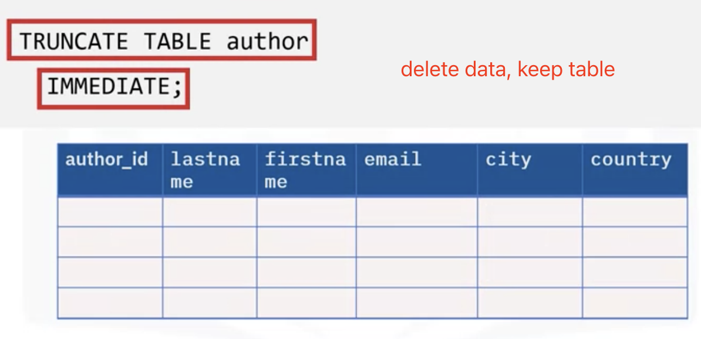

# Intro To Relational Data Bases and Tabels

### ERD

Entity-Relationship Model

Primary key of a relational table uniquely identifies each tuple or row in a table, preventing duplication.
Foreign keys which are primary keys defined in orther tables, creating a link between two tables.

### Cloud Databases

Which can Expand/Shrink(accommodate changing needs and usage demands) Storage & Compute Resources
Pay per use

##### Database as Service DBaaS

DBaas provide users with access to Database resources in cloud without setting up underlying hardware and installing software.

## Type of SQL statements (DDL vs DML)

SQL statements fall into two diff categories: 

- **Data Definition Language**: <u>Define, Change, or drop data</u>

  Create, 

  Alter(adding and dropping columns and modify their data types), 

  Truncate(delating data in the table but not table itself) 

  and drop(deleting tables)

- **Data Manipulation Language**: 

  Read and modify data

  CRUD operations(Create, Read, Update, Delete)

  INSERT

  SELECT

  UPDATE

  DELETE

## CREATE TABLE Statement

Primary key not null: This **constraint** prevents duplicate values in the table

Names of columns; Datatypes of columns; Constraints (e.g. Primary Key)

## <u>Alter</u>, Drop and Truncate 

BIGINT can hold a number up to 19 digits long

Values in cells must compatiable with new type

delete the table , not only data

