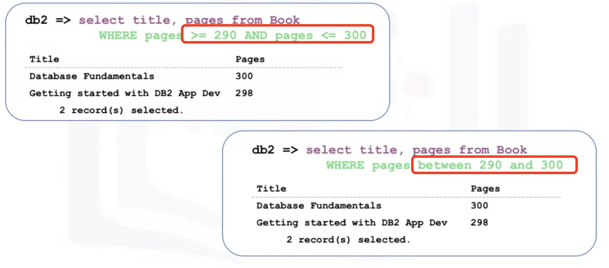

# Intermediate SQL

## Refining your result

### Using <u>String Patterns</u> and Ranges

- Like: WHERE first name LIKE R%

  % persent sign is used to define the missing letters; which can be placed b<u>efore/after/b and a</u> the pattern

- between .. and .. (instead of AND)

  

- IN (instead of OR)

  

  

### <u>Sorting</u> Result Sets

how to indicate which column to use for the sorting order
(Alphabetical order)

###### ORDER BY
ascending order by default

Is the start letter same, so the sorting will be started from the point where the characters differ.

Use number to indicate the column
select title, page from Book <u>ORDER BY 2</u>;

### <u>Grouping</u> Result Sets

I want to know which country the authors from and how many authors come  from each country.

###### Having ("where" clause is for the entire result set, "Having" works only with group by )

## Functions, Multiple Tables, ans Sub-queries

### Built-in Database Functions

Can speed up data processing: rather than first retriving the data onto your application and then process

###### Aggregate function: SUM(), MIN(), MAX(), AVG()

###### Give Alias:

select SUM(COST as SUM_OF_COST from PETRESCURE

##### Scalar and String Functions

Round(), Length(), Ucase, Lcase,

If i do not clear about the Upper or Lower case used in cells when I use WHERE, i can use <u>UCASE and LCASE</u>

### Data and Time Built-in Functions

###### Functions: YEAR(), MONTH(), DAY(), DAYOFMONTH(), DAYOFWEEK(), DAYOFYEAR(), WEEK(), HOUR(), MINUTE(), SECOND()

Select DAY(data_column)
Select (data_column + 3 <u>DAYS</u>) from table

- special registers: **CURRENT_DATE, CURRENT_TIME**

  Select (CURRENT_DATE - data_column) from table

can conbine with WHERE clause as well

### Sub_Queries and Nested Selects

Sub_Q is like a regular query but placed within parentheses and nested inside another query

##### Utilized with WHERE
<u>The limitation of aggregate function:</u>

how to circumvent this limitation: Nested query

#### Other utilisations

### Working with ***multiple*** Tables

1. Sub_queries

2. Implicit JOIN

BTW the result table columns will be like :  E.column_name

