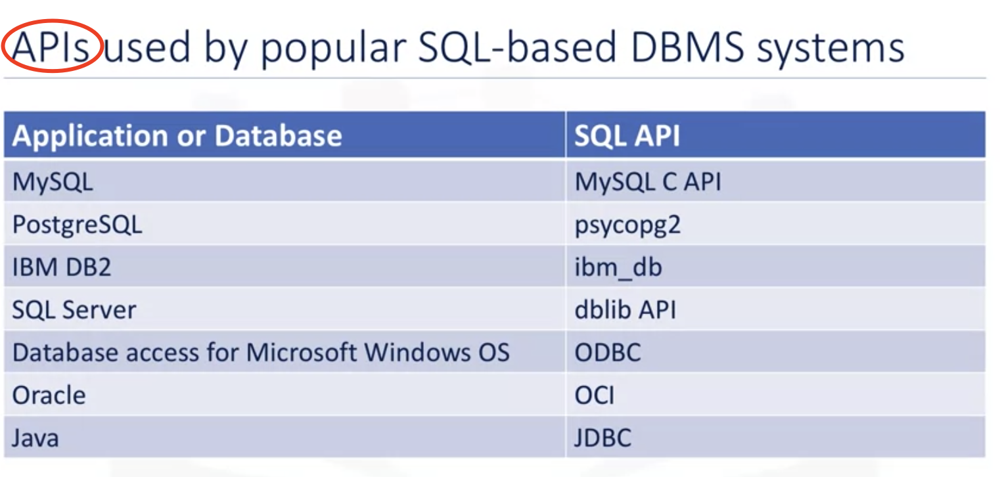
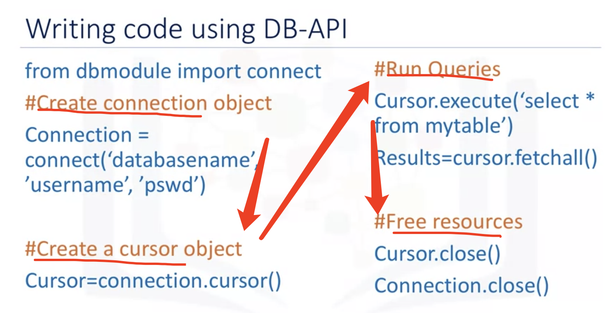
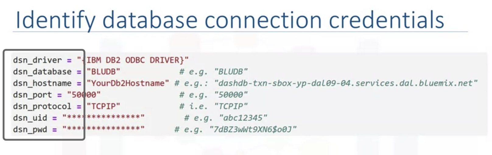
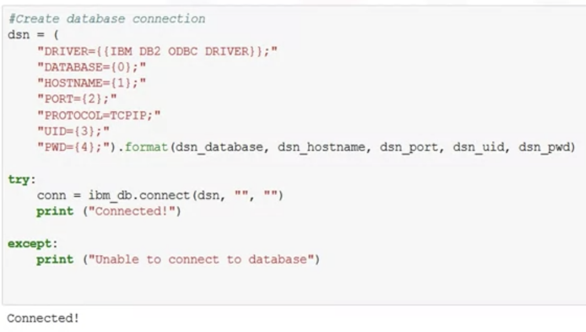
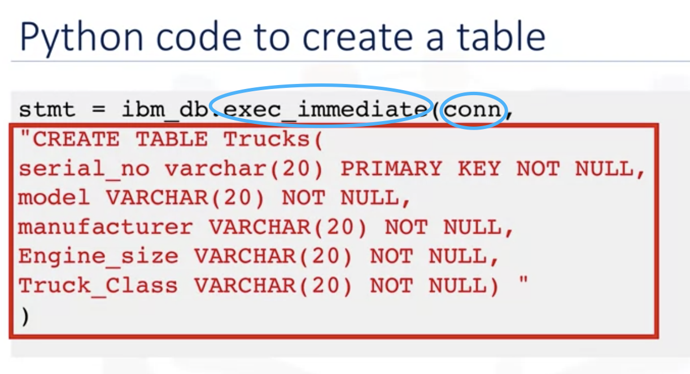
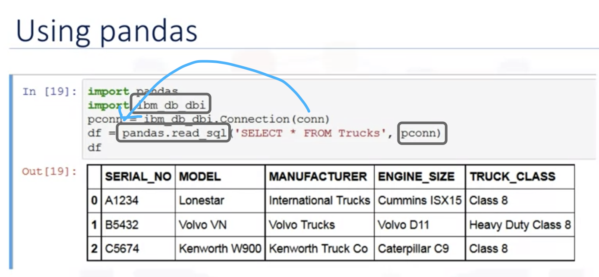
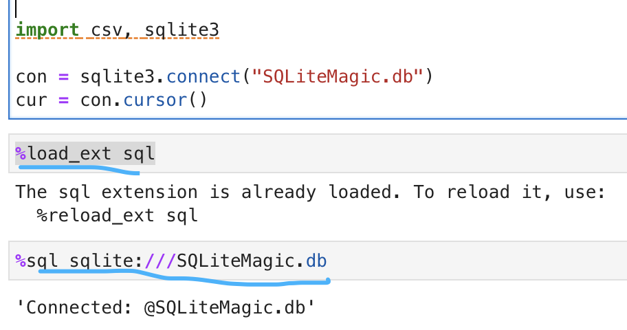
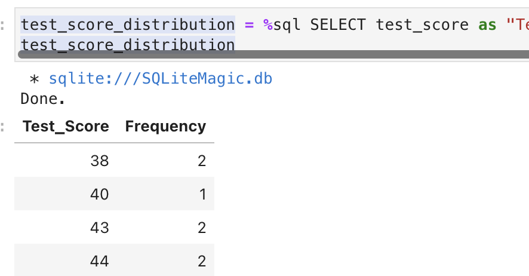

# Accessing DB Using Python

## How to Access Databases Using Python

## Writing code using DB-API

Program open a "Connection" to gain it's contents
A "cursor" is like a file handle to have access to query

##### Connection methods

.cursor()
.commit()
.rollback()
.close()

##### Cursor method:

.callpro()
.execute()
.executemany()
.fetchone()
.fetchmany()
.fetchall()
.nextset()
.arrysize()
.close()

## Connecting to a databse using ibm_db API

CLOSE: ibm_db.close(conn)

## Creating tables, loading data and querying data

stmt = Ibm_db.exec_immediate(conn)

Query:
Ibm_db.fetch_both(stmt)

##### Using Pandas

## Analyzing data with python

stmt = ibm_db.exec_immediate(conn,"SELECT count(*) FROM MC")
Ibm_db.fetch_both(stmt)

pconn = ibm_db_dbi.Connection(***conn***)
df = pandas.read_sql("Command", pconn)
df

Magic SQL:

<u>%%sql</u>: the whole cell is sql command

###### Using Python Variables in your SQL Statements
country = "Canada"
<u>%sql</u> select * from INTERNATIONAL_STUDENT_TEST_SCORES where country = :country

###### Assigning the Results of Queries to Python Variables

dataframe = test_score_distribution.DataFrame().   can change result to DataFrame directly

W4:https://www.coursera.org/learn/sql-data-science/ungradedLti/GUr2q/optional-hands-on-lab-analyzing-a-real-world-data-set

