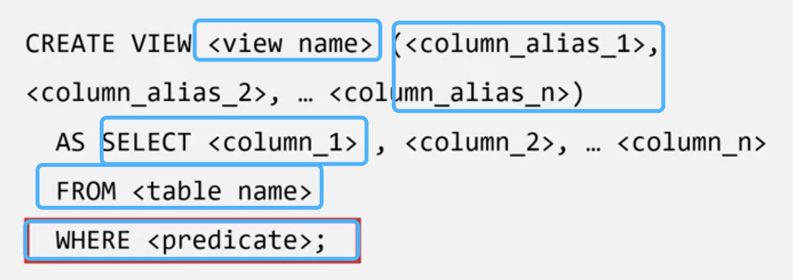
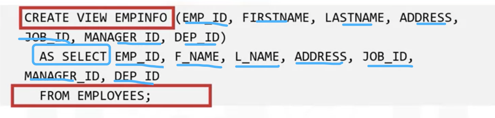
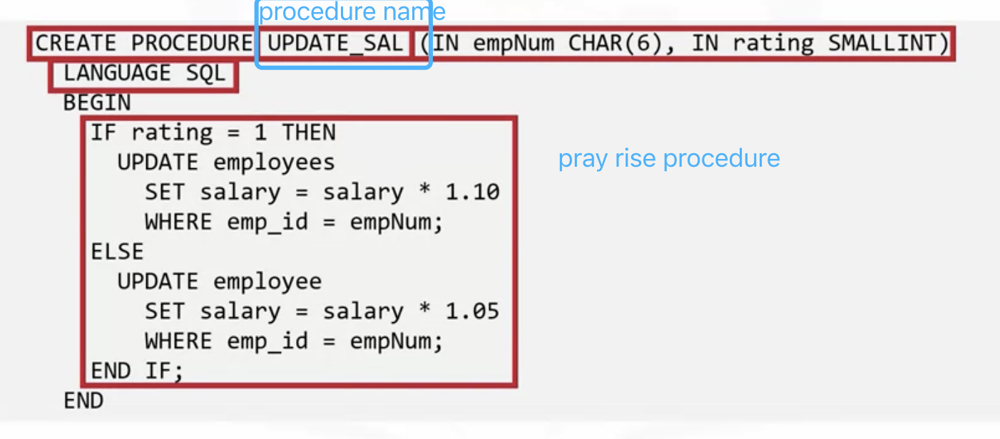
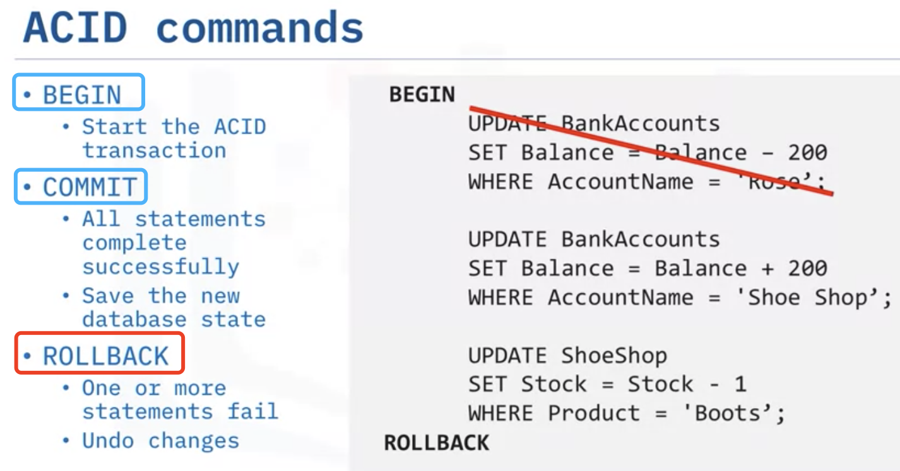
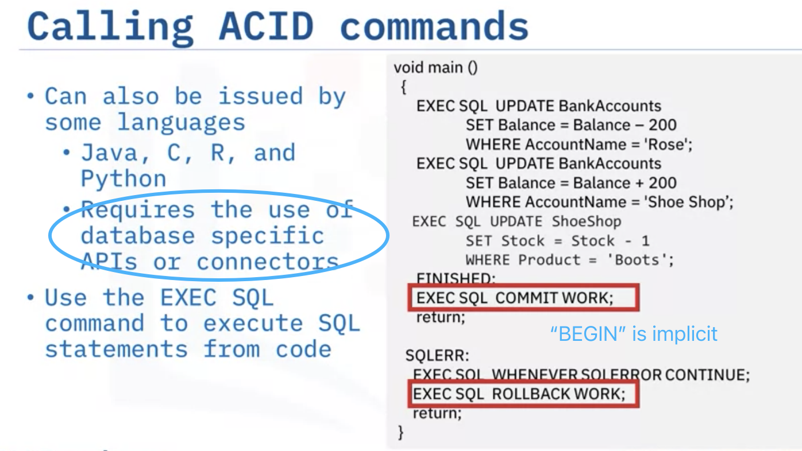
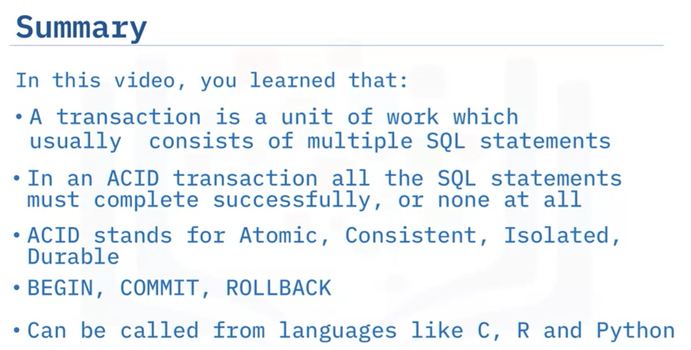
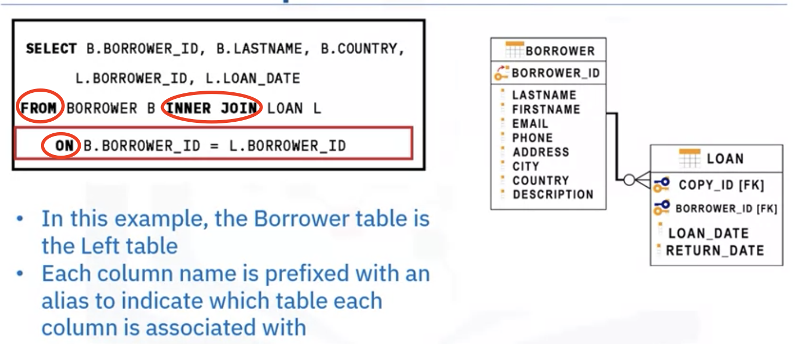
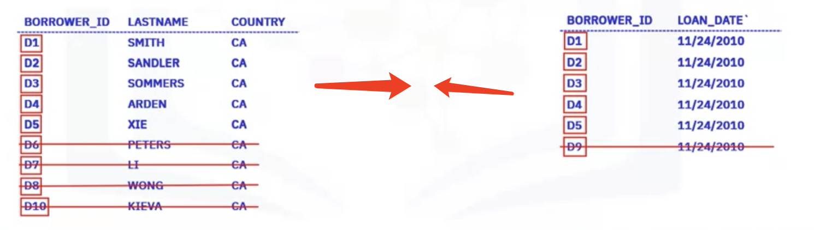
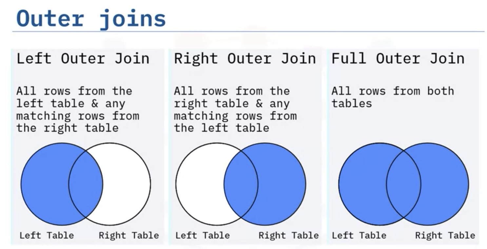
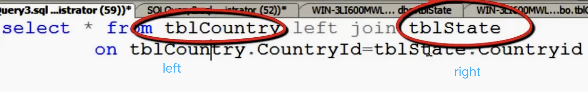

# High level SQL

- view
- stored procedure
- ACID Tranctions
- Join Overview; Inner Join; Outer Joins

## View

- A view can inclure specific columns from multiple base tables and existing views(<u>Kind of like the Pivot Table in Excel</u>). And data in the table can be modified by view
- Once created, can be queried like a table
- Only the definition of the view is stored, not the data of table itself

#### Views can

- show a selection of data without sensitive portions
- combine two tables in a meanful way
- **Simplify access to data**

can not use OEDER BY clause

- remove a view : DROP VIEW viewname

## Stored procedure(Like a function)

- A set of SQL statements stored and executed on the database server

  <u>Instead of sending multiple SQL statements from the client to server, encapsulating them in a stored procedure on the server and send one statement from the client to execute them</u>

- **Benefit**: Reduction in network traffic; Improvement in performance; Reuse of code; 

  <u>Increase in security</u>: A: do not need to expose all of table and column infos to client-side developers  B:use server-side logic validate data before accepting into the system

Invocation: CALL UPDATE_SAL('E1001', 1)

## ACID (Atomic, consistent, isolated, durable) Transactions(like a tightly bunded code block)

- indivisible unit of work 
- consists of one or more SQL statements
- either all happens ot onne

If any of these UPDATE statemts fail, the whole transaction must fail.

## Join

to combine data from two tables, we use JOIN operator

A JOIN combines the rows from two or more tables bases on a relationship betweenn certain columns in these tables 

## Inner join

Only rows from tables have matching values in a common column
Usually the primary key of one table that exists as a foreign key in the second table

## Outer joins

From rows in tables that do not match

Outer joins also return rows that do not have match cols in two tables

### Left outer join

All the data of the left table will be displayed irrespective it has a matching entry or not. (Then the rest cols whill be filled by NULL)
But only data which is having mathing entries of the right table will be displayed.  

### right..

### Full..

Show everything.

