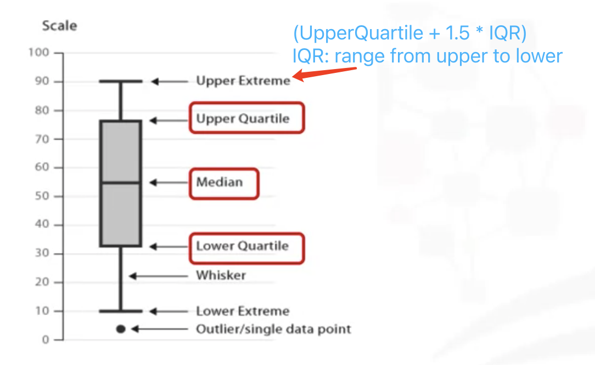
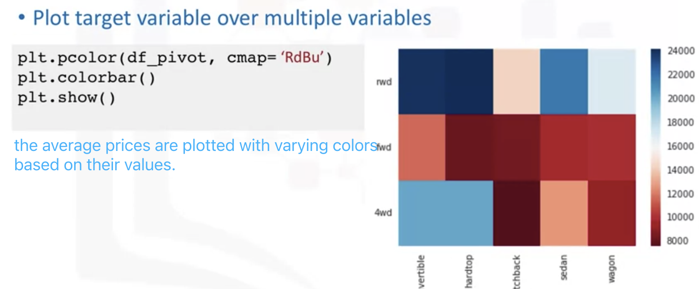
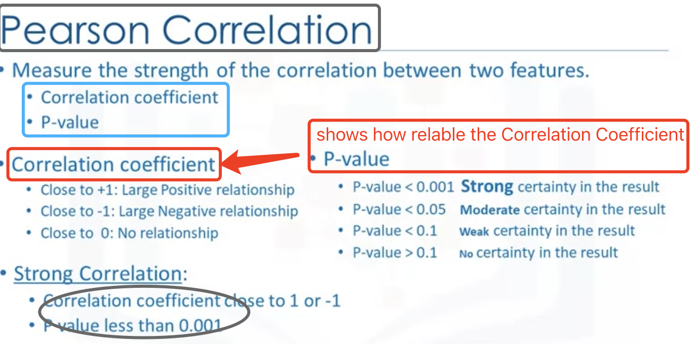
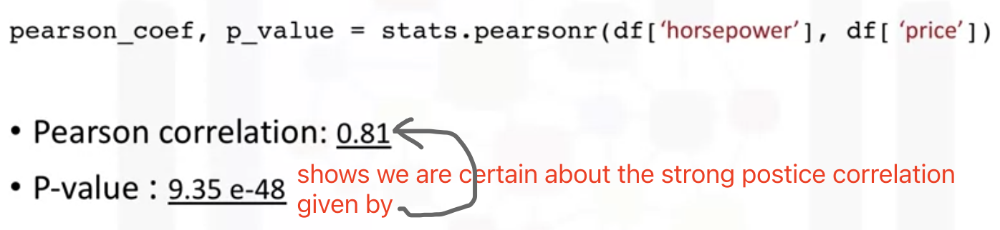
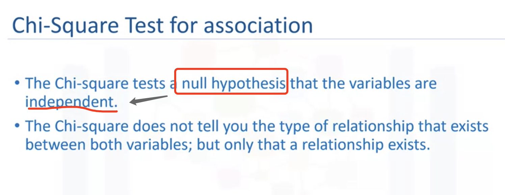
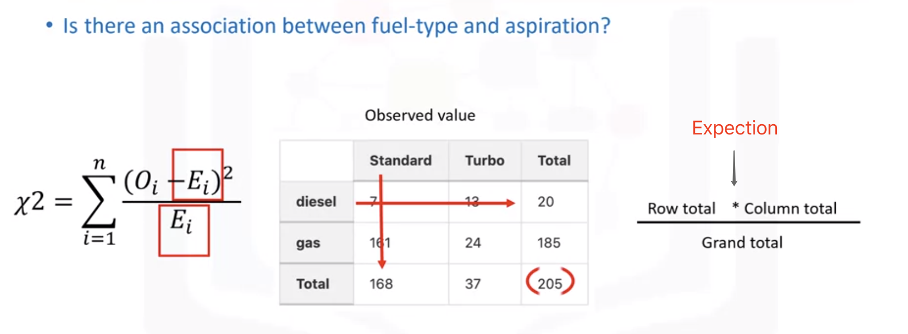
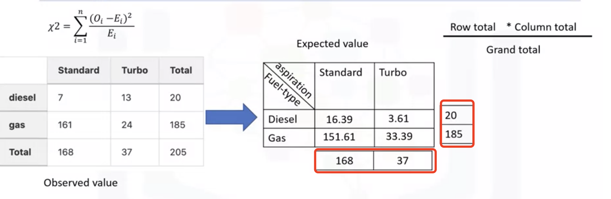
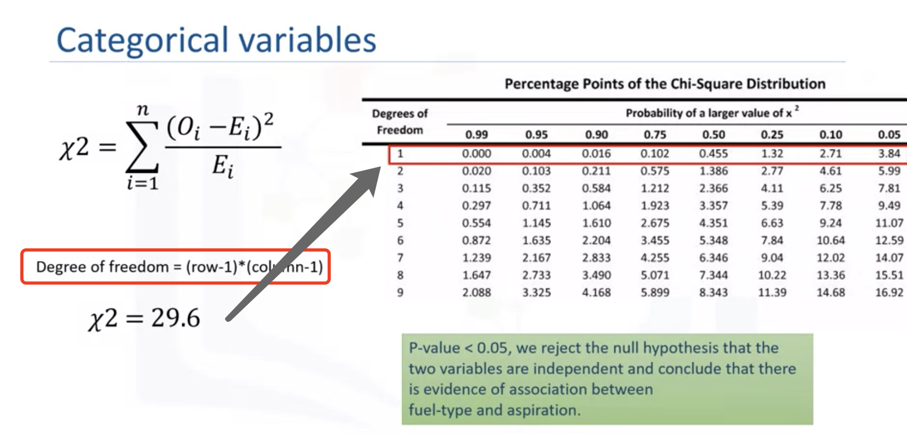

# Exploratory Data Analysis

- Descriptive Statistics
- Box chart/plot
- Group by 
- Correlation
- Correlation-statistic
- Association between two categorical variables: Chi-Square

## Exploratory DA (EDA)

#### Exploratory DA

- Descriptive Statistics 
- GroupBy
- Correlation between values
- Correlation -Statistics (Pearson correlation and Heat maps)

#### Descriptive Statistics

**df.describe()**: gross number of data points. mean. deviation, quartiles. and extram values

**Box chart/plots**: a good chart to <u>describe</u> data

#### GroupBy in Python

If i am interested in finding the average price of vehicles and observe how they **differ betwen different types** of body styles and drive wheels variables.

heatmap

#### Correlation

- Sis.regplot(x = "highway-mpg", y = "price", data = df)

plot a linear regression plot: 
the slope is deep means two variables have strong correlation.
the line flat means week correlation.

#### Correlation - Statistics

- Pearson Correlation

  

- HeatMap

  

#### Association between two <u>categorical</u> variables: <u>Chi-Square</u>

The test is intended to test how likely it is that an observed distribution is due to chance.

#### <u>ANOVA</u>

ANOVA analyzes the **difference between different groups of the same variable**, the groupby function will come in handy

>- F-test core:  ANOVA assumes the means of all groups are the same, calculates how much the actual means deviate from the assumption, and reports it as the F-test score. A larger score means there is a larger difference between the means
>- P-value: P-value tells how statistically significant our calculated score value is.
>
>If our price variable is **strongly correlated** with the variable we are analyzing, we expect ANOVA to return a **sizeable F-test** score and a **small p-value**.

Explory the correlation between two types of "drive-wheels" : 4wd and rwd 

f_val, p_val = stats.f_oneway(grouped_test2.get_group('4wd')['price'], grouped_test2.get_group('rwd')['price'])

