# Model Development

## Model Development

- Simple and Multiple Linear Regression
- Model Evaluation using Visualization
- Polynomial Regression and Pipelines
- R-squared and MSE for In-Sample Evaluation
- Prediction and Decision Making

## 1. Linear Regression and Multiple Linear Regression

The parameter is the output of trainning models be fitted with trainning points.

- <u>Simple Linear Regression(SLR)</u> useually be used for explore the correlation between two variables.

  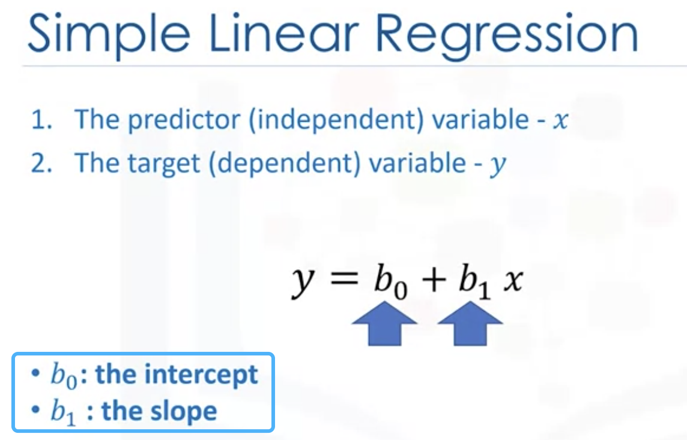

  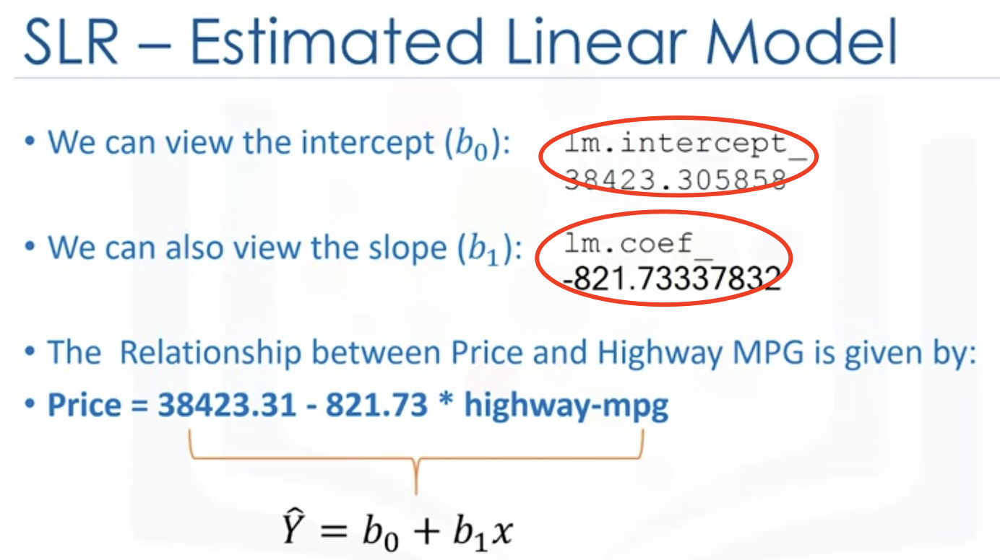

- <u>Multiple Linear Regression(MLR)</u> 

  

  z = df[['A','B','C','D']]

  Lm.fit(Z, df['price'])

  Yhat = lm.predict(X)

## 2. Model Evaluation using visualization

Residual Plot: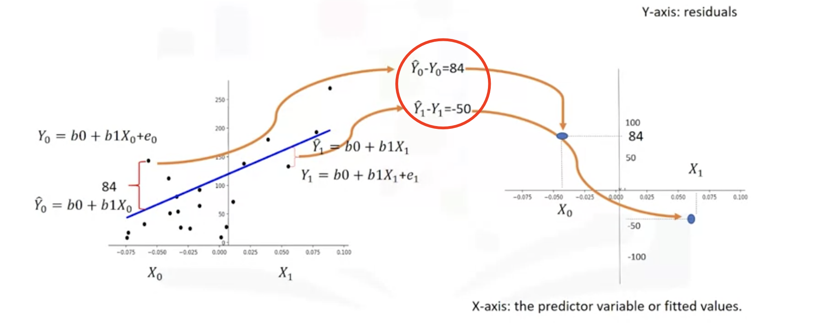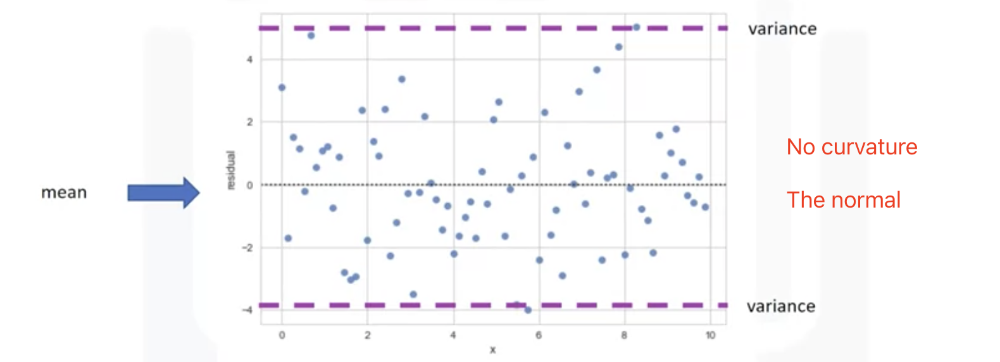
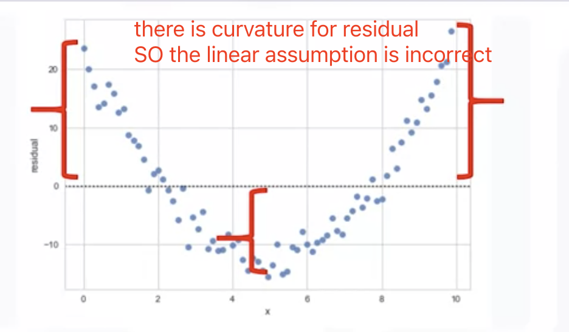
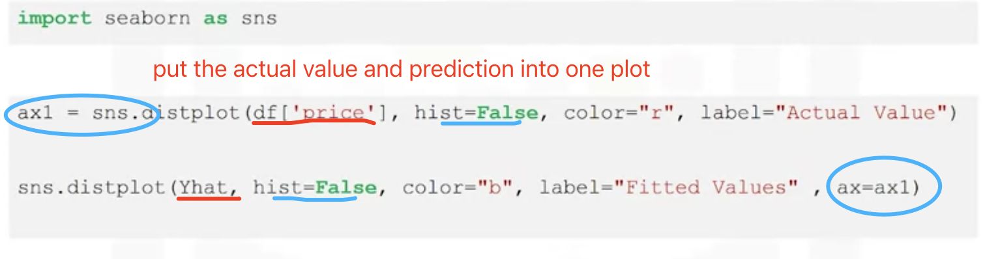

Residual plot:

Sis.residplot(df['highway-mpg'], df['price'])

## 3. Polynomial Regression and Pipelines

##### High-order polynomial regression

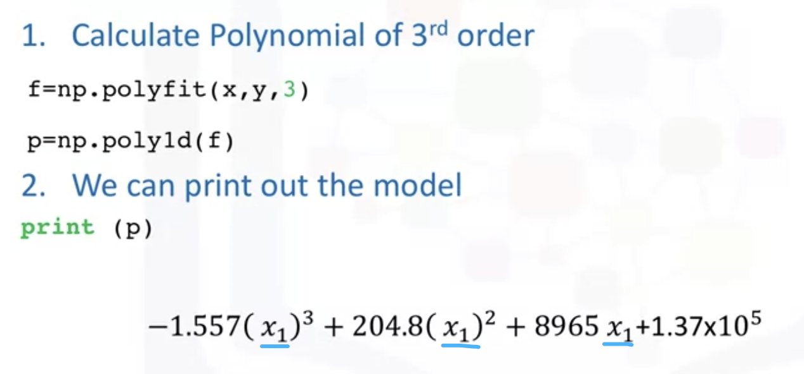

##### Polynomial regression with more than **One D** (polyfit can not handle this case)

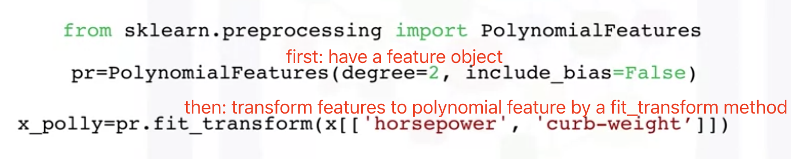

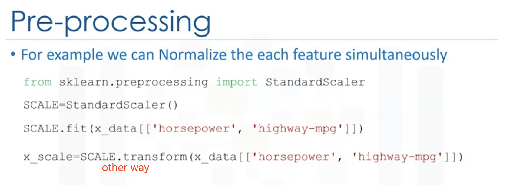

##### Pipelines

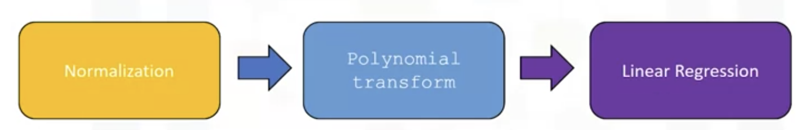

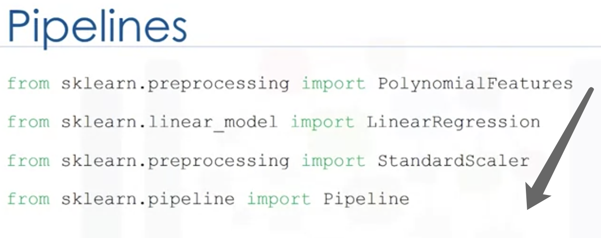

 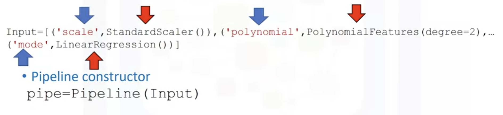

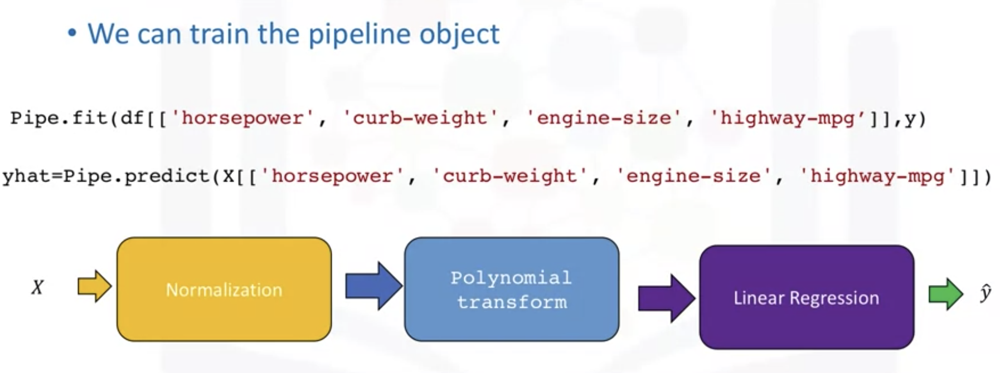

## 4. Measures for In-sample Evaluation

Numerically evaluation: a way to numerically determine how good the model fits on dataset.

- Mean Squared Error(MSE): <u>From sklearn.metrics import mean_squared_error</u>

  

  Mean_squared_error(df['price'], Y_predict_simple_fit)

  <u>Both use the average value of the data points</u>

- R-squared(R^2): **<u>lm.score(X,Y)</u>**  normally between 1 and 0

  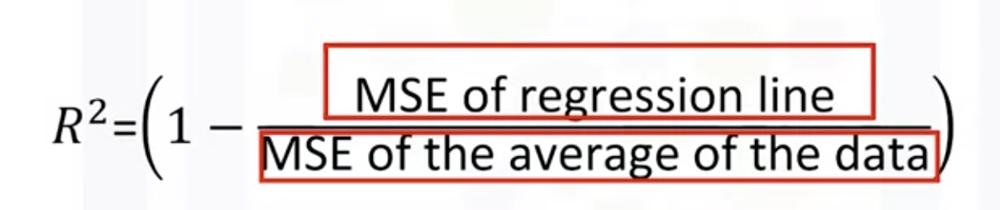
  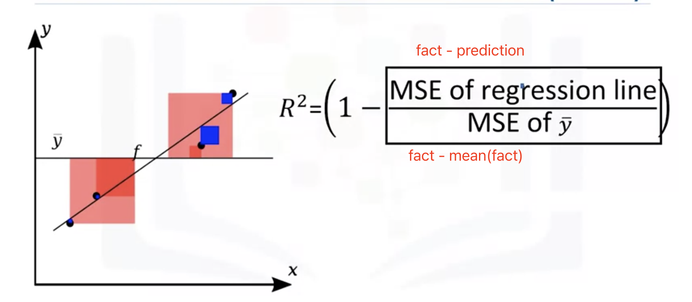

  R^2 near 1, means 1- **0**, which means the line good fit for data

## 5. Prediction and Decision Making

