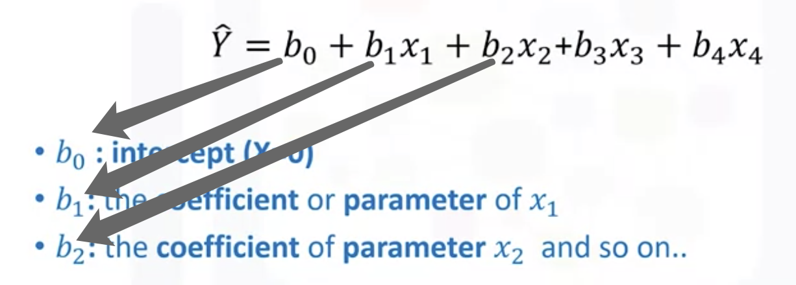

# Model Development

## Model Development

- Simple and Multiple Linear Regression
- Model Evaluation using Visualization
- Polynomial Regression and Pipelines
- R-squared and MSE for In-Sample Evaluation
- Prediction and Decision Making

## 1. Linear Regression and Multiple Linear Regression

The parameter is the output of trainning models be fitted with trainning points.

- <u>Simple Linear Regression(SLR)</u> useually be used for explore the correlation between two variables.

  

  

- <u>Multiple Linear Regression(MLR)</u> 

  

  z = df[['A','B','C','D']]

  Lm.fit(Z, df['price'])

  Yhat = lm.predict(X)

## 2. Model Evaluation using visualization

## 3. Polynomial Regression and Pipelines

## 4. Measures for In-sample Evaluation

## 5. Prediction and Decision Making

