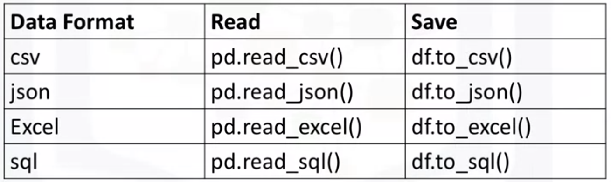

# Importing Data Set

## The Problem

## Understanding the Data

## Python packages for Data Science

- Pandas; NumPy; SciPy

- Matplotlib; Seaborn

- Algorithms: Scikit-learn (ML:regression, classification)

  Statsmodels: (Explore data, estimate statistical models and perform statistical tests)

## Importing and Exporting Data in python

## Getting started Analyzing Data in Python

Why check data types?
Potential info and type mismatch.
Compatibility with python methods.

df.dtype()      df.describe()      df.info():show first and bottom 30 rows

##  Accessing DataBases with Python

Cursor()

Commit()

Rollback()

Close()

> In this lesson, you have learned how to:
>
> **Define the Business Problem:** Look at the data and make some high-level decision on what kind of analysis should be done
>
> **Import and Export Data in Python:** How to import data from multiple data sources using the Pandas library and how to export files into different formats.
>
> **Analyze Data in Python:** How to do some introductory analysis in Python using functions like **dataframe.head()** to view the first few lines of the dataset, **dataframe.info()** to view the column names and data types.