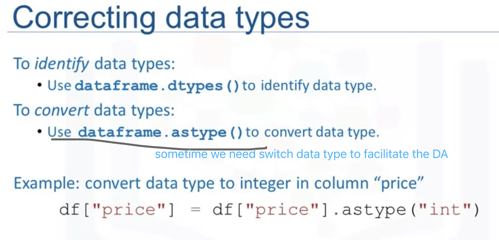
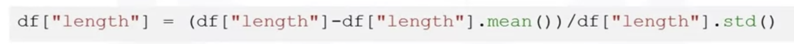

# DataWrangling

## Pre-processing Data in python

(Data Cleaning; Data Wrangling)

## Dealing with Missing Values in Python

## Dealing with Missing Values in Python

- <u>Drop</u>: Df.fropna() use axis = 0,1 to denote to delete row0 or column1

- <u>Replace</u>: df.replace(missing_calue, new_values)

## Data Formatting in Python

## Data Normalization in Python

The different **range**s of different features will influence the future analysis such as regression. SO WE NEED NORMALIZATION

##### 3 ways

3⃣️deviation sigma; and the resulting values hover around zero, typically range -3 and 3(but can be higher or lower)

- Z-score 

## Binning in Python

bins = np.linspace(min(df["price"]), max(df["price"]), 4)
Group_name = ["Low", "Medium", "High"]
Df["price-binned"] = pd.<u>cut</u>(**df["price"]**, bins, labels = group_name, include_lowest = True)

## Turning categorical variables into quantitative variables

##### Problem: Most statistical models cannot take in the objects/strings as input. ( One-Hot )

- get_dummies()

  pd.get_dummies(df['fuel']): automatically generates a list of numbers each one corresponding to a particular category of the variable.