# w5_ModelEvaluation

##### Out-of-sample evaluation or test set

- Model Evaluation and Redfinement
- Overfitting, Underfitting and model Selection
- Ridge Regression
- Grid Search

Tell us how our model works in a real world

## 1. Model Evaluation and Redfinement

Using a *lot of data for training*, gives us a accurate means to determing how well our model will perform in the real world. But the precision of perfomance will be low.

If we use *fewer data points* to train the model and more to test the model, the accuracy of the generalization performance will be less but the model will have good precision.

- Cross validation : **cross_val_score()**

  the dataset will be split to several folds. And we continue use most for traning and less for test until every fold is used for bith testing and training.

  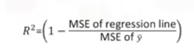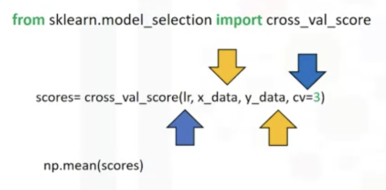

- Cross_val_predict()
  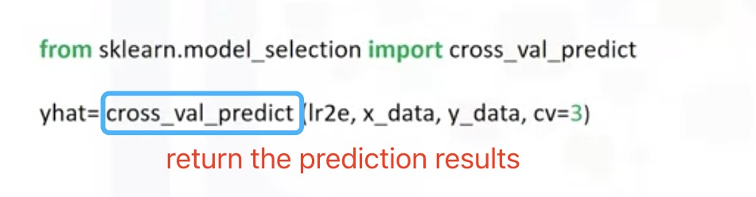

## 2. Overfitting, Underfitting and model Selection

Undercutting:  model is too simple to fit the data

Overfitting: Estimated function oscillate not tracking the function. Estimated function extramly good at tracking the data but estimating the function.

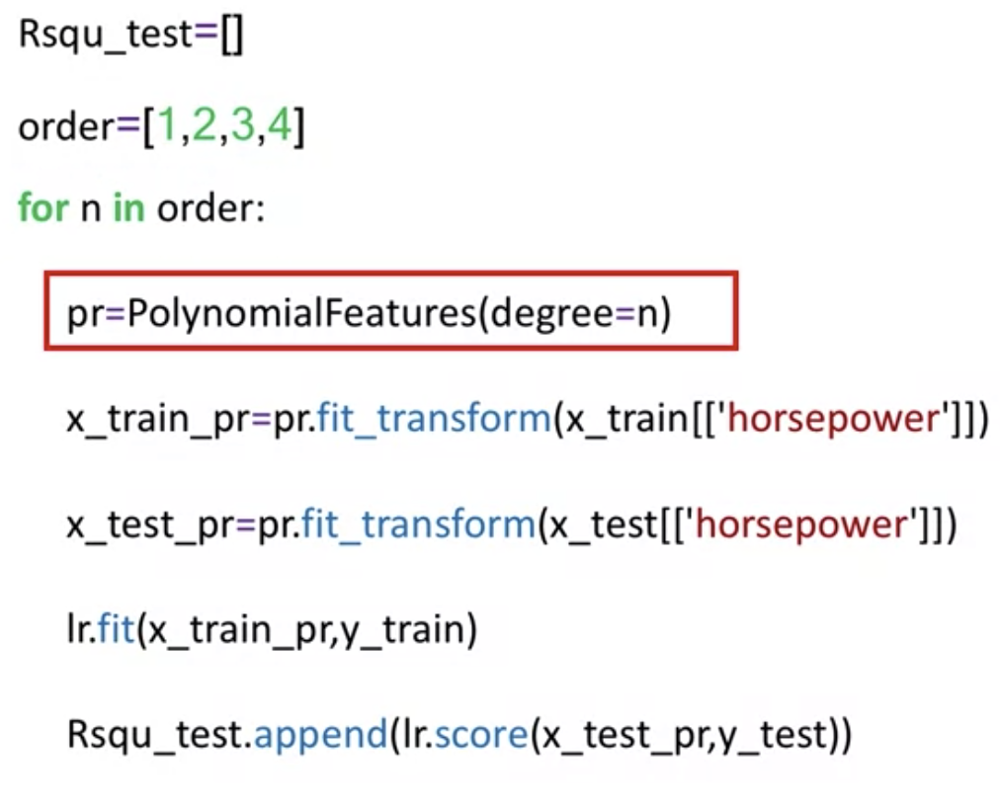

## 3. Ridge Regression

##### Normalization and Regularisation: 

Normalization is useful when your data has varying scales and the algorithm you are using does not make assumptions about the distribution of your data, such as **k-nearest neighbors** and artificial neural networks. Regularization is a feature scaling technique that is intended to **solve the problem of overfitting**.

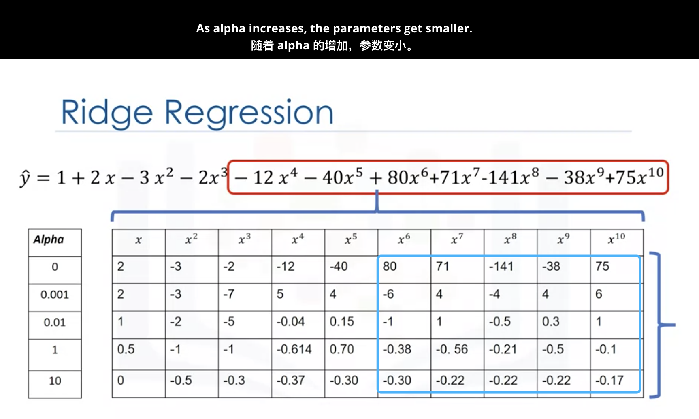

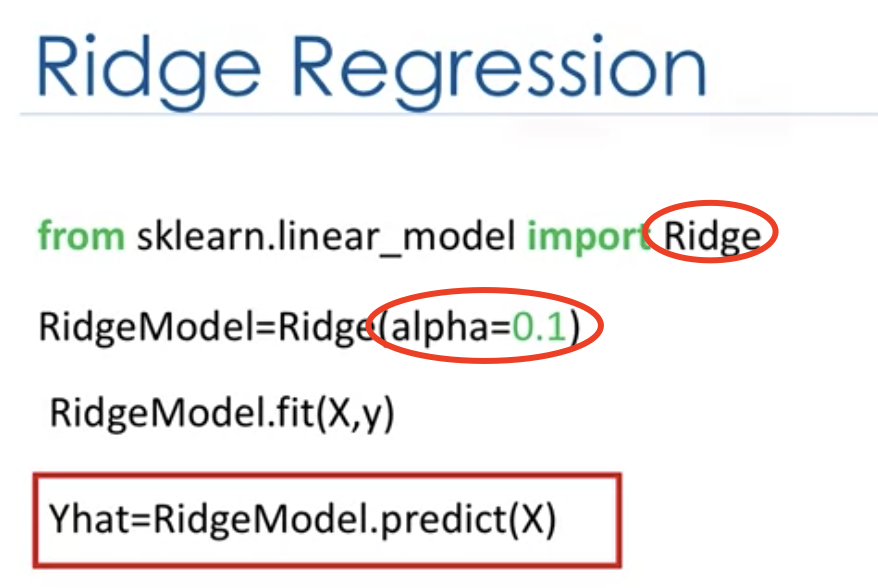

- How to determine Alpha

1.Cross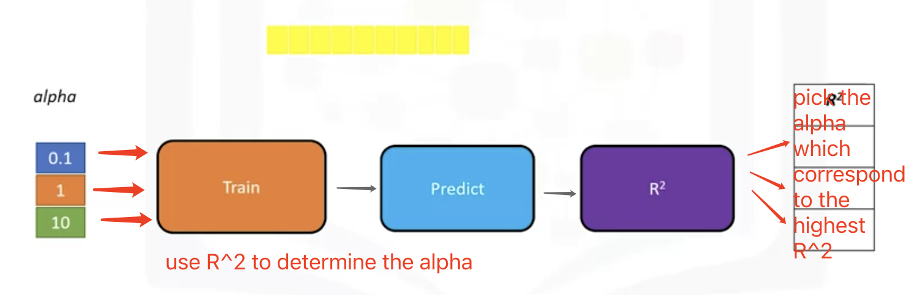

2.MSE

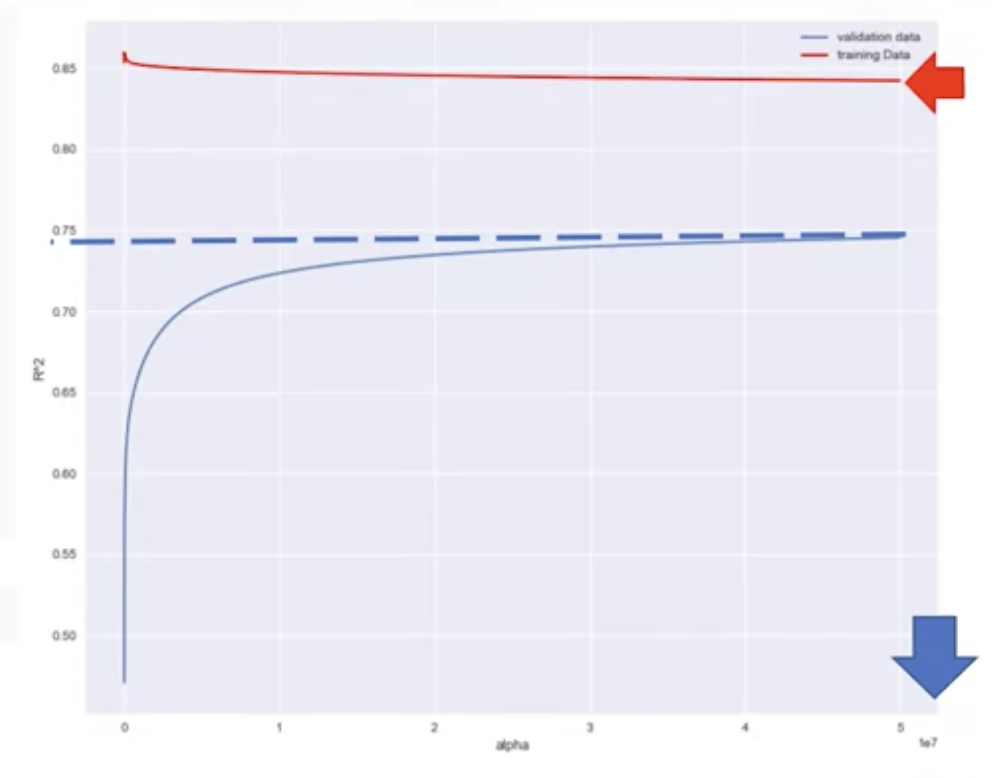

## 4. Grid Search (Tune hyper-parameters of an estimator)

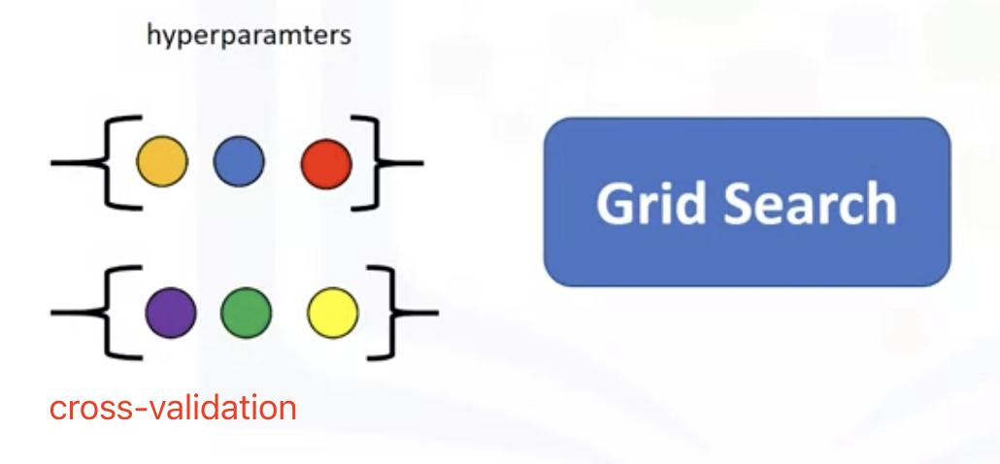

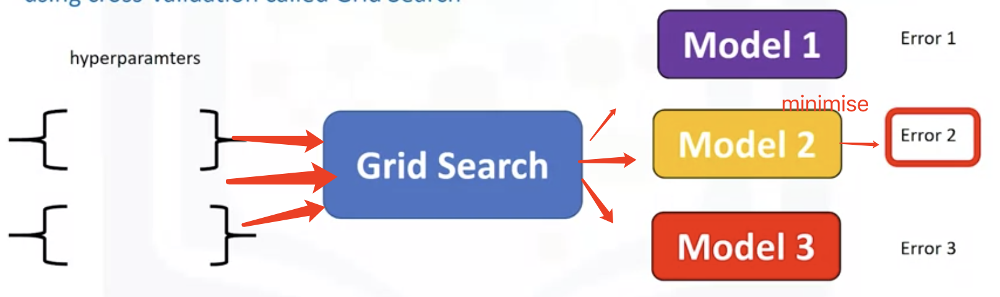

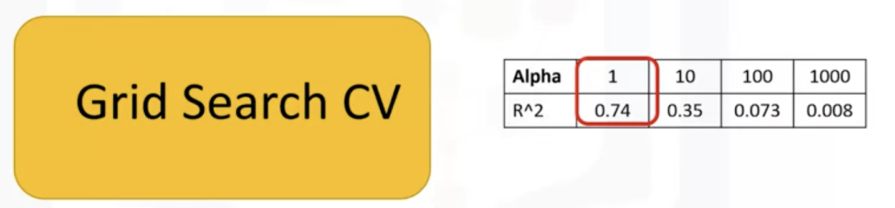

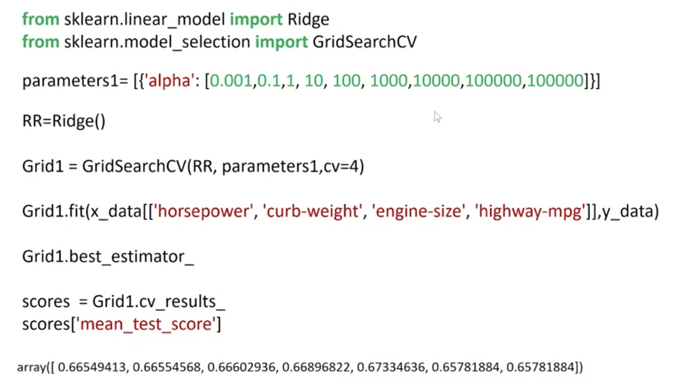

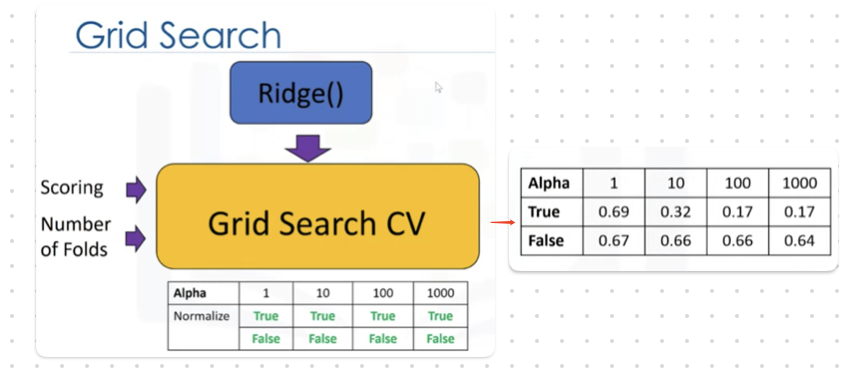

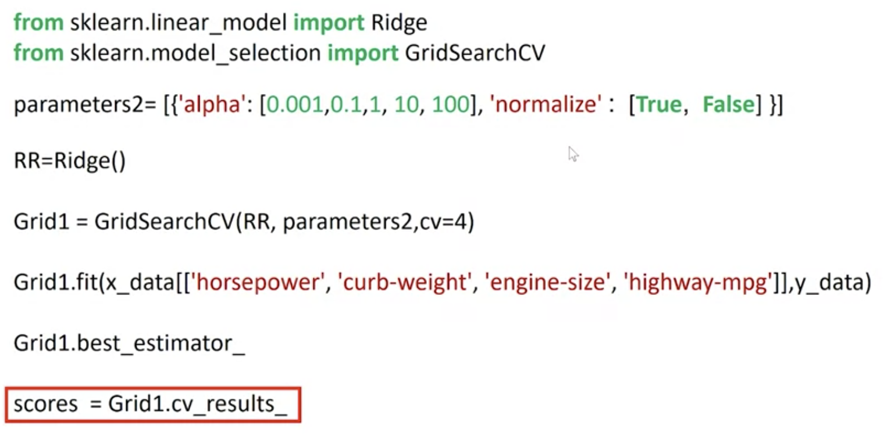

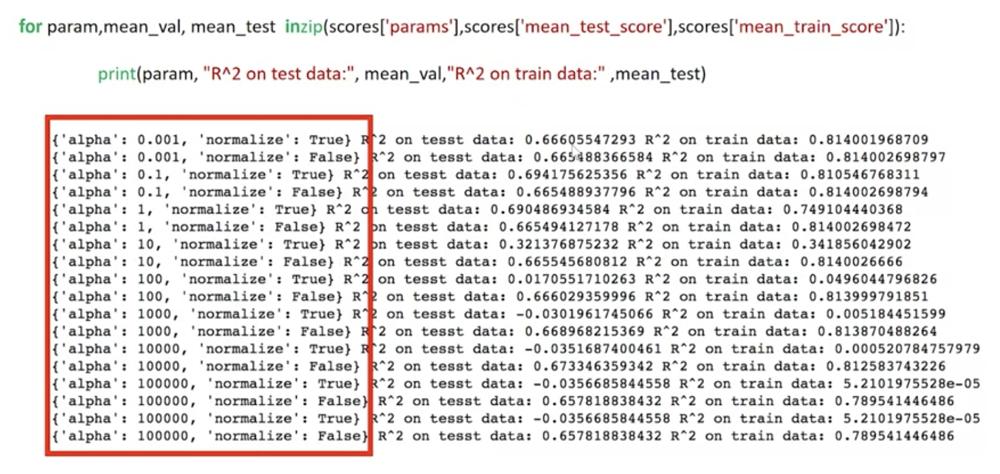
