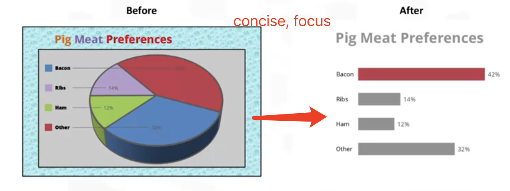
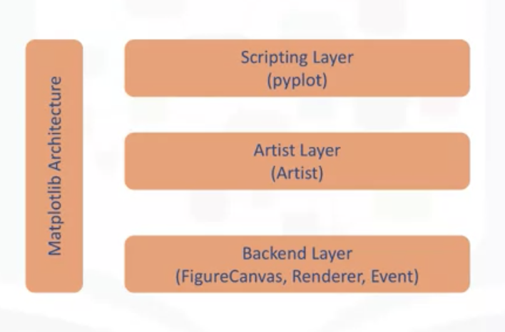
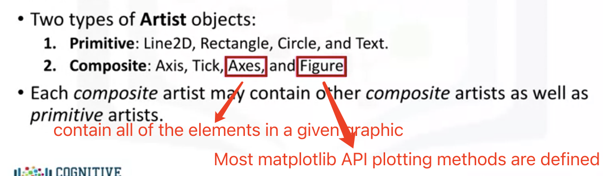
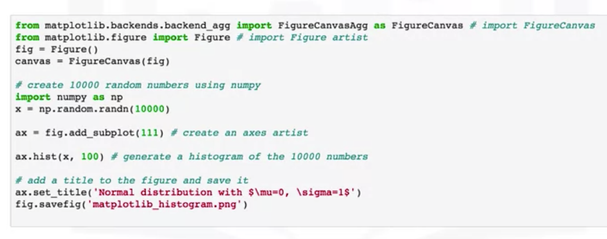
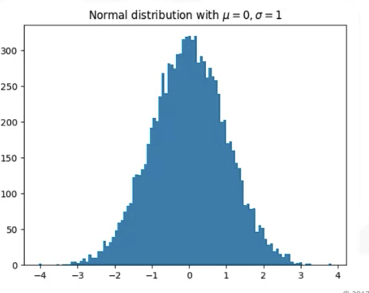
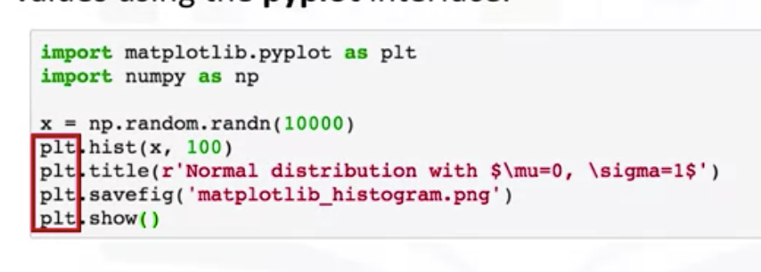
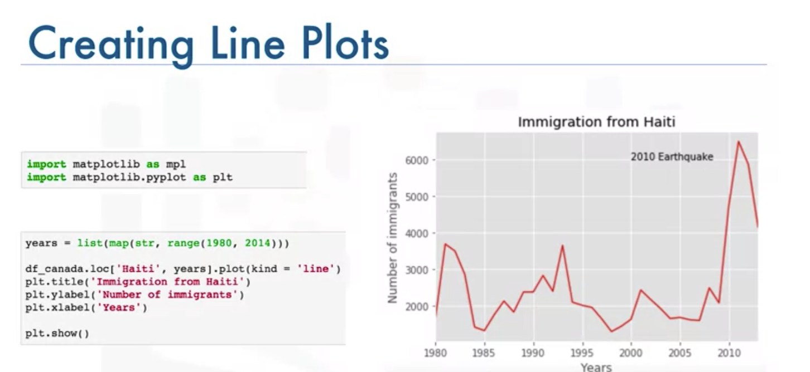

# Data Visualization with Python

> - Introduction to Data Visualization
> - Introduction to Matplotlib
> - Basic Plotting with Matplotlib
> - Dataset on Immigration to Canada
> - Line Plots
> - Lab: Introduction to Matplotlib and Line Plots
> - Quiz: Introduction to Data Visualization Tools

## Intro to DV

## Intro to Matplotlib

1. For exploratory DA

2. Communicate data clearly ( a pic is worth a thoursand words)

3. Share unbiased representation of data

4. Use them to support recommendations to different stakeholders

5. > Less is more EFFECTIVE/ ATTRACTIVE/ IMPACTIVE

More example: http://www.darkhorseanalytics.com/

## Basic Plotting with Matplotlib

##### Backend Layer

- FigureCanvas
- Renderer
- Event

##### Artist Layer: 
Artist: the artist is an object know how to use the render and put ink on the canvas

##### Scripting Layer (Metplotlib.pylot interface) :smile:

**lighter** than artist layer

## Dataset on Immigration to Canada

 We can literally create almost all of the conventional visualization tools  histograph, box, line with only one function: **plot**

## Line Plots

