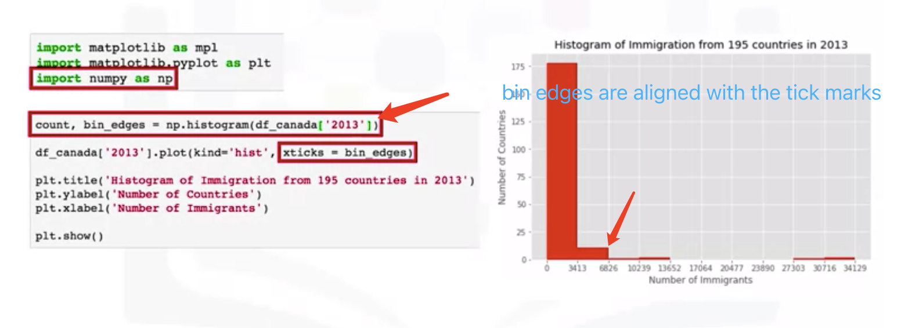
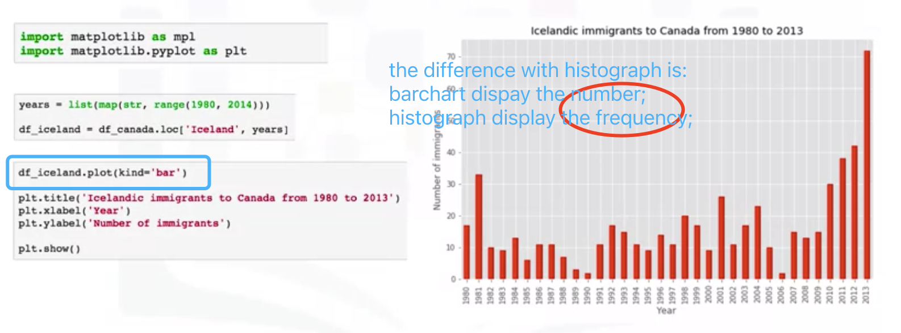
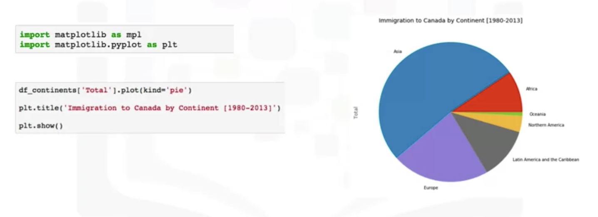
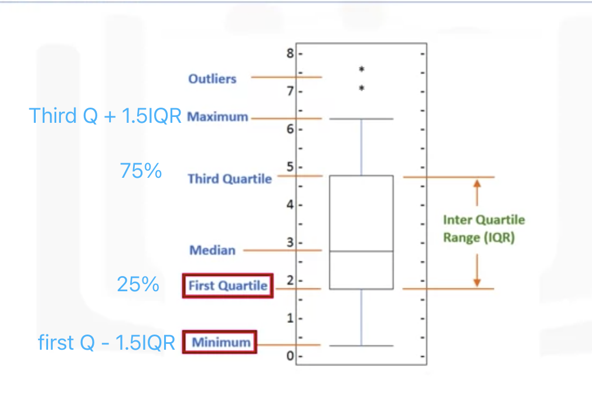
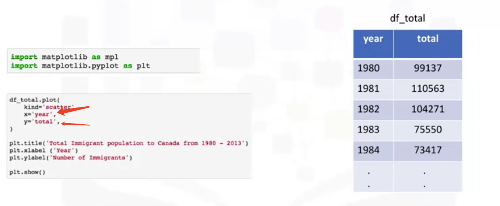

# Basic And Specialized VisualizationTools

> - Area Plots
> - Histograms
> - Bar Charts
> - Pie Charts
> - Box Plots
> - Scatter Plots
> - Bubble Plots
> - Lab: Basic Visualization Tools
> - Lab: Specialized Visualization Tools
> - Quiz: Basic Visualization Tools
> - Quiz: Specialized Visualization Tools

#### Area Plots
kind = 'area'

#### Histograms

Representing the frequency distribution. Partition the spread of the numerical data into bins. 

The vertical axis is actually the ferquency or the number of datapoints in each bin.

#### Bar Charts

## Specialized Visualization Tools

#### Pie Charts

#### Box Plots

#### Scatter Plots

##### Bubble Plots

