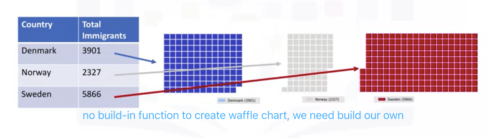
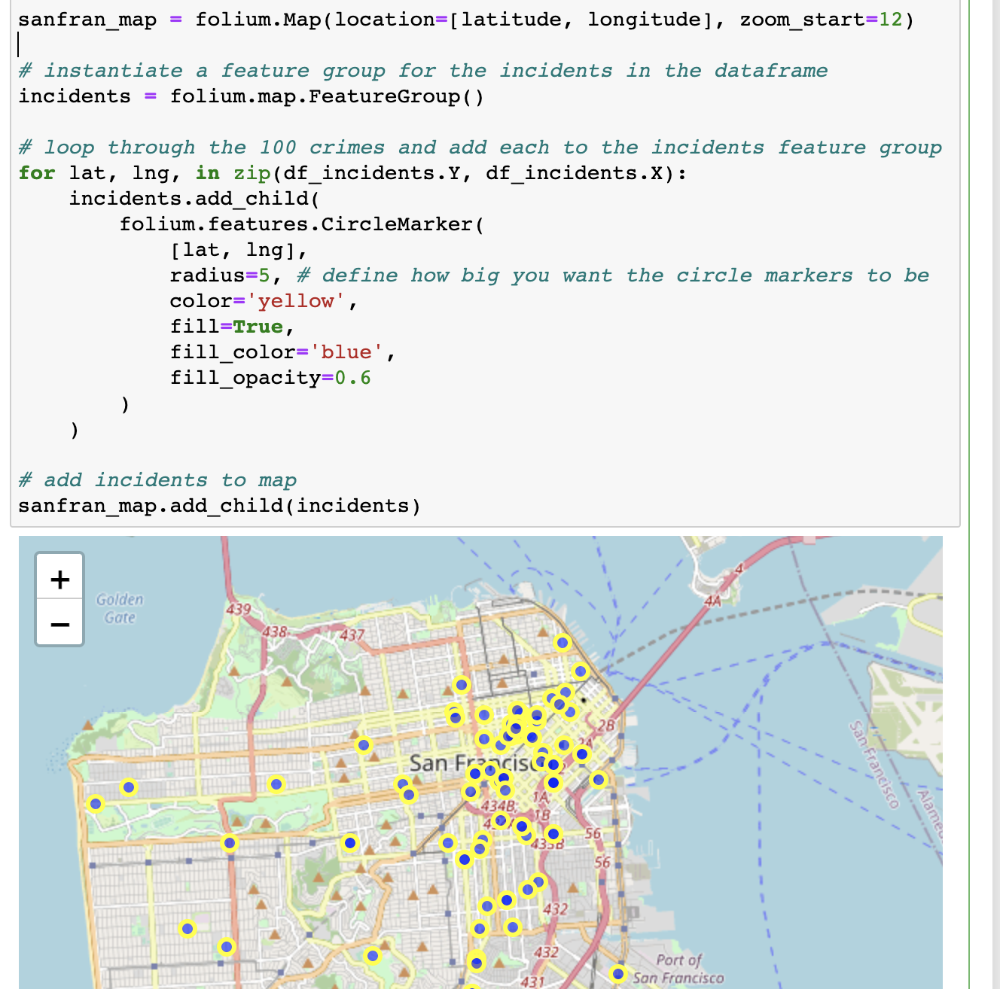

# Advanced Visualization And Geospacial Tools

> - Waffle Charts
> - Word Clouds
> - Seaborn and Regression Plots
> - Introduction to Folium and Map Styles
> - Maps with Markers
> - Choropleth Maps

### Waffle Charts



- **Step 1.** The first step into creating a waffle chart is determing the proportion of each category with respect to the total.

- **Step 2.** The second step is defining the overall size of the `waffle` chart.
- **Step 3.** The third step is using the proportion of each category to determe it respective number of tiles
- **Step 4.** The fourth step is creating a matrix that resembles the `waffle` chart and populating it.
- **Step 5.** Map the `waffle` chart matrix into a visual.
- **Step 6.** Prettify the chart. Create a legend and add it to chart.

### Word Clouds


1. Drop redundent words(stopwords)
2. Create a WordCloud project
3. Generate the word cloud: alice_wc.generate(alice_novel)
4. **What interesting is**:  Implement with the `word_cloud` package is superimposing the words onto a *mask* of any shape. <u>(Perform parameter ("mask" = A pic) when create the word cloud project)</u>

### Seaborn and Regression Plots

Seaborn is more concise and light than matplotlib.

**Parameters**:Color, marker


### Introduction to Folium and Map Styles

- A powerful library to create leaflet maps
- Enalble bith binding of data to a map for **choropleth visualizations** as weel as passing visualizations as markers on the map


### Maps with Markers

- **SuperImpose circles on the map**

After generate a map:
instantiate a feature group for the incidents in the dataframe
incidents = folium.map.FeatureGroup()

Then: incidents.add_child(.....)




- **Add pop-up text**

```python
# add pop-up text to each marker on the map
latitudes = list(df_incidents.Y)
longitudes = list(df_incidents.X)
labels = list(df_incidents.Category)

for lat, lng, label in zip(latitudes, longitudes, labels):
    folium.Marker([lat, lng], popup=label).add_to(sanfran_map)    
    
# add incidents to map
sanfran_map.add_child(incidents)
```

- **cluster markers**

```python
from folium import plugins

# let's start again with a clean copy of the map of San Francisco
sanfran_map = folium.Map(location = [latitude, longitude], zoom_start = 12)

# instantiate a mark cluster object for the incidents in the dataframe
incidents = plugins.MarkerCluster().add_to(sanfran_map)

# loop through the dataframe and add each data point to the mark cluster
for lat, lng, label, in zip(df_incidents.Y, df_incidents.X, df_incidents.Category):
    folium.Marker(
        location=[lat, lng],
        icon=None,
        popup=label,
    ).add_to(incidents)

# display map
sanfran_map
```


### Choropleth Maps

 The thing is:

```python
# download countries geojson file
! wget --quiet https://cf-courses-data.s3.us.cloud-object-storage.appdomain.cloud/IBMDeveloperSkillsNetwork-DV0101EN-SkillsNetwork/Data%20Files/world_countries.json
    
print('GeoJSON file downloaded!')
```


