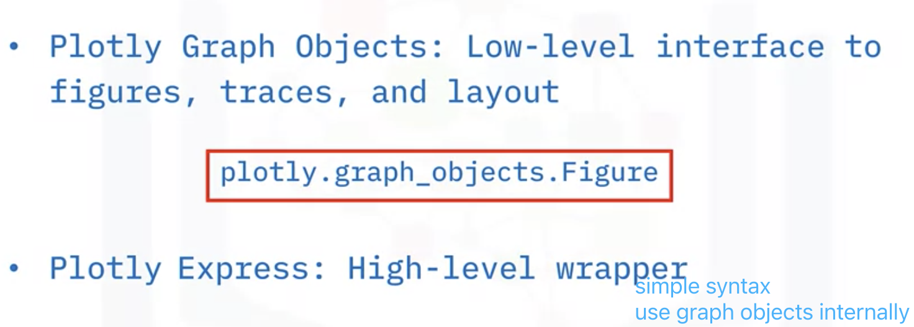
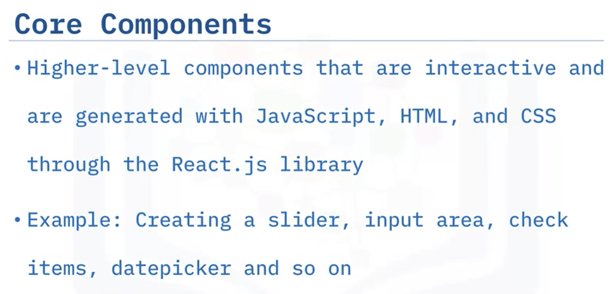
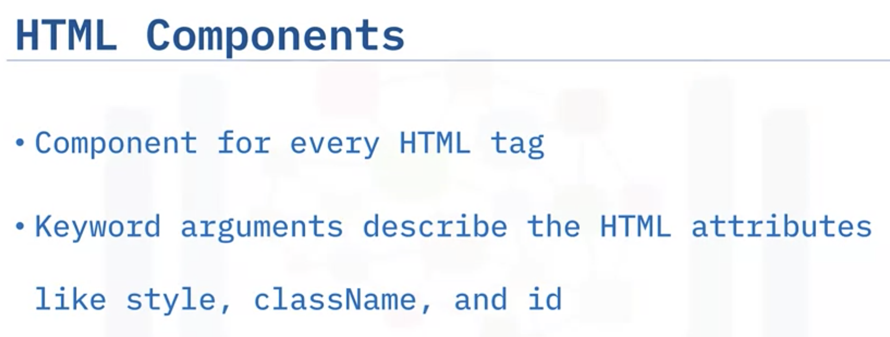

# Creating Dashboard With Dashand Ploty

## Dashboarding Overview

- Present a real time data instead of static data
- More succinct

Dash; Panel; Voila , Streamlist; Bokeh, ipywidgets,Bowtie, Flask

## Introduction to Ploty



**Scatter**:

```python
import plotly.graph_objects as go
fig=go.Figure()
fig.add_trace(go.Scatter(x=age_array, y=income_array, mode='markers', marker=dict(color='blue')))
# show x,y titles
fig.update_layout(title='Economic Survey', xaxis_title='Age', yaxis_title='Income')
```


**Line Plot**:

```python
fig.add_trace(go.Scatter(x=months_array, y=numberofbicyclessold_array, mode='lines', marker=dict(color='green')))
# add title , labels
fig.update_layout(title='Bicycle Sales', xaxis_title='Months', yaxis_title='Number of Bicycles Sold')
```


**Bar Plot**:

```python
import plotly.express as px
fig = px.bar( x=grade_array, y=score_array, title='Pass Percentage of Classes') 
```

**Histogram**:

```python
fig = px.histogram(x=heights_array,title="Distribution of Heights")
```


**Bubble**:


```python
fig = px.scatter(bub_data, x="City", y="Numberofcrimes", size="Numberofcrimes",
                 hover_name="City", title='Crime Statistics', size_max=60)
fig.show()
```


**Pie**:

```python
fig = px.pie(values=exp_percent, names=house_holdcategories, title='Household Expenditure')
```


**Sunburst Charts**:

```python
data = dict(
    character=["Eve", "Cain", "Seth", "Enos", "Noam", "Abel", "Awan", "Enoch", "Azura"],
    parent=["Centre", "Eve", "Eve", "Seth", "Seth", "Eve", "Eve", "Awan", "Eve" ],
    value=[10, 14, 12, 10, 2, 6, 6, 4, 4])

fig = px.sunburst(
    data,
    names='character',
    parents='parent',
    values='value',
    title="Family chart"
)
fig.show()
```

The `data` dictionary contains three lists: `character`, `parent`, and `value`. Each of these lists corresponds to a column in the chart.

The `px.sunburst()` function is used to create the Sunburst chart. The `names` parameter specifies which column to use for the labels on each level of the chart. In this case, it's set to "character", so the character names will be displayed on each level. **The `parents` parameter specifies which column to use for the parent-child relationships**. In this case, it's set to "parent", so each character's parent will be displayed as the immediate parent. The `values` parameter specifies which column to use for the size of each slice in the chart. In this case, it's set to "value", so the numeric value associated with each character will determine the size of each slice.


## Intro to Dash

- Core components: 
  Import dash_core_components as dcc

  

- HTML components
  import dash_html_components as html



## Make Dashboards interactive

**Callback**


