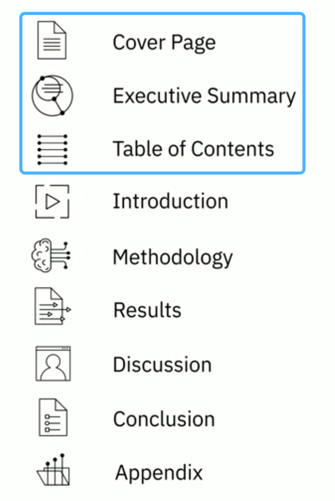
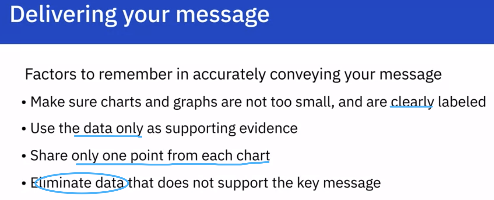

# Organize report

##### To clearly deal with representation in a structured way.

- #### **Build a outline: (remember towards to audience)**

- **Executive Summary**
  Briefly explain the details
  Considered a stand-alone document ( This information is taken from the main points of your report )
  
- **Introduction**
  Nature of the analysis
  States the problem
  States questions for analysis
  
  what is this report about
  who is the report for
  what will a reader gain by reading through this report
  
- **Methodology**
  Explain the data sources
  Outlines the plan for the collected data
  
- **Results**
  Detail of the data collection, how it was organized and how it was analysed.
  Charts and graphs.
  By this interpretation of data, give a detailed explanation to the audience and how it relates to the problem that was stated in the introduction.
  
- **Discussion Finding and implications**

- **Conclusion**
  Reiterate the problem; Gives an overall summary of findings.; The outcome; Future
  
- **Appendix References**
  Information do not really fit into main body:
  The locations where the raw data was collected.
  Resources, acknowledgements or references

# Presenting your findings

Not heavily base on the data, engage a story around data.

Charts

Key messages

Avoid irrelevant data

##### Checklist for Budding data scientists

> - Have you told readers, at the outset, what they might gain by reading your paper?
> - Have you made the aim of your work clear?
> - Have you explained the significance of your contribution?
> - Have you set your work in the appropriate context by giving sufficient background (including a complete set of relevant references) to your work?
> - Have you addressed the question of practicality and usefulness?
> - Have you identified future developments that might result from your work?
> - Have you structured your paper in a clear and logical fashion?

